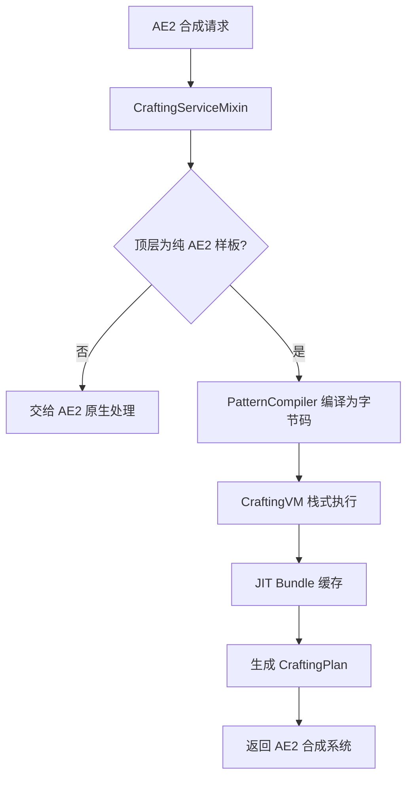

# AE2 VM — AE2 合成虚拟机


> **English version**: [README_en.md](README_en.md)
> **Author**: Tao &nbsp;|&nbsp; **QQ**: 2584300846 &nbsp;|&nbsp; **GitHub**: [AE2-VM](https://github.com/TaoLe-si/AE2-VM)

**AE2 VM** 是 [Applied Energistics 2](https://github.com/AppliedEnergistics/Applied-Energistics-2) 的 Forge 扩展模组。它将 AE2 原本的**递归合成树遍历**替换为**栈式虚拟机（Stack-based VM）执行编译后的字节码**，实现合成计算的极限加速。适用于深度嵌套的大型合成配方（如 AE2 扩展包中的无限存储元件）。

---

## 性能

| 场景 | 原版 AE2 | AE2 VM | 加速比 |
|------|----------|--------|--------|
| 1× quantum_omni_cell_16k | ~90s | ~38ms | **~2,400×** |
| 10^3× quantum_omni_cell_64m | — | ~17ms | — |
| 10^6× quantum_omni_cell_64m | N/A | ~10ms | — |
| 10^6× 递归样板 (1A→1A) | 无法计算 | ~秒算 | — |
| 10^9× creative_ae_cell_long | N/A | ~280ms | — |

> 原版 AE2 使用递归遍历，合成树深度每增加一层，耗时指数增长。VM 将遍历转为顺序字节码执行 + JIT 缓存，达到亚秒级计算。
> 「—」表示原版 AE2 无基线（无法计算 / 未测量），无法给出加速比。

---

## 能力与修复（v1.10.x）

- **递归 / 自引用配方（v1.10.3）**：`A+B→2A` 放大器与 `A+B→A+C` 精华催化剂——自产出抵消自消耗，自键收敛为一次性种子，主输出按净增修正合次数；种子缺失时恰报缺 1 种子。
- **换算环守恒（v1.10.3）**：无副产物纯换算环（`9B→A, 1A→9B, …`）价值守恒——BigInteger 分数精确求环值，不足时恰报最小价值键缺失（消除"无种子报可行"假阳）。
- **催化剂反馈环 working-capital（v1.10.2）**：副产物闭环的可行种子（working capital）精确计算。
- **耐久工具（v1.10.2）**：有限次使用工具（`amount × ceil(times/uses)` 闭式）。
- **处理配方默认模糊（v1.10.2）**：处理配方输入按同物品完整模糊族（任意 NBT）匹配网络库存（GTL 温室 / MA 精华）。
- **可复用库存种子模糊（v1.10.3）**：宿主私有可复用库存路由（`returnedFrom`）按模糊族匹配变体库存。
- **模糊替换只作用于替换槽（v1.10.5）**：物品/流体替换组只满足**开启了替换的槽位**；精确槽（单变体）强制由主变体库存或合成主变体满足，精确槽叶子缺失时正确报缺失。修复了 2026-08-09 视频中"计划看似完成、CPU 执行却卡死（进度 0 / ETA 暴涨）"的假可行 bug。
- **斐波那契指数链（v1.9.8+）**：O(patterns+edges) 需求传播聚合替代逐路径展开，24 层 10⁹ 请求秒算。
- **模糊组库存聚合（v1.9.13）**：聚合期求和整组库存，替换变体库存满足槽位时不再假缺失。

---

## 测试与基准（版本 1.10.7）

> 以下数据来自 `gradlew.bat cleanTest test --no-daemon`（BUILD SUCCESSFUL），未编造。

```
测试类: 18    用例: 136    失败: 0    错误: 0    跳过: 0
构建: BUILD SUCCESSFUL
闪电基准: cases=39 supported=38 falsePositive=1 engineError=0 timeout=0
边界基准: cases=37 ok=37 feasible=36
```

### 闪电基准（Thunderbolt-Core 参考能力，39 例）

13 图族 × 3 材料模式（MISSING / MINIMUM / UNBOUNDED），13 图族全部 SUPPORTED：

| 图族 | 状态 |
|---|---|
| 单配方 DAG（dispersed / fibonacci） | ✅ SUPPORTED |
| 多配方 DAG（greedy-trap / fibonacci） | ✅ SUPPORTED（fibonacci/minimum 为唯一 FALSE_POSITIVE） |
| 环裁切（conversion-ring / self-growth-cut） | ✅ SUPPORTED |
| 催化剂 / 反馈环（returned-seed / raw / lossy） | ✅ 9/9 SUPPORTED |
| 耐久链（finite-use-chain） | ✅ 3/3 SUPPORTED |
| 模糊 / 可复用库存（variant-route） | ✅ 3/3 SUPPORTED |
| 递归 / 自引用（amplifier / essence-catalyst） | ✅ 6/6 SUPPORTED |

> 唯一剩余 FALSE_POSITIVE：`multi-dag/fibonacci/minimum`（多样板最优选择），需全局优化器（BoundedCombinations / 线性求解器），非引擎错误。

### 边界能力基准（37 例）

`craftable-primary-white-stock amt=100 (white=1)` 修复前 `missing={white_wool=99}` → 修复后 `missing={}`；
全部 37 例与期望可行性一致（36 可行 + 1 不可行 sanity）。

---

## 工作原理



- **样板编译**：编码时把所有 AE2 样板预编译为独立字节码（`DUP → RECORD_PATTERN → EXTRACT → CALL_BY_KEY → … → INSERT_OUTPUT → RETURN`），子样板运行时懒解析，全局缓存。
- **栈式虚拟机**：BigInteger 栈无限精度；顺序执行无递归；0–1023 常用值预分配；2 的幂次走位运算快路径。
- **JIT Bundle 缓存**：cts=1 记忆化（子树 Δ 直接复用）、cts>1 `scale(cts)` 一次放大（O(1) 批量回放）、跨请求静态缓存。
- **无限精度**：中间值永不溢出，输出转 AE2 long API 时 cap 到 `Long.MAX_VALUE`。

## 字节码指令集

| Opcode | 值 | 说明 |
|--------|-----|------|
| `PUSH_ITEM` | 0x00 | 压入物品数量 × 倍数 |
| `PUSH_LONG` | 0x01 | 压入 64 位整数 |
| `ADD` | 0x02 | 加法（溢出检测 → BigInteger） |
| `SUB` | 0x03 | 减法（溢出检测 → BigInteger） |
| `MUL` | 0x04 | 乘法（2 的幂次快速路径） |
| `DIV_ROUNDUP` | 0x05 | 向上取整除法 |
| `EXTRACT_INGREDIENT` | 0x06 | 从模拟网络提取原料 |
| `RECORD_OUTPUT` | 0x07 | 记录产出 |
| `RECORD_INGREDIENT` | 0x08 | 记录原料（旧） |
| `RECORD_MISSING` | 0x09 | 记录缺失物品 |
| `DUP` | 0x0A | 复制栈顶 |
| `POP` | 0x0B | 弹出栈顶 |
| `SWAP` | 0x0C | 交换栈顶两个值 |
| `RECORD_PATTERN` | 0x0D | 记录样板执行（用于 AE2 作业调度） |
| `CALL` | 0x0E | 调用编译好的样板字节码 |
| `RETURN` | 0x0F | 返回调用者 |
| `CALL_BY_KEY` | 0x10 | 按物品 Key 懒解析子样板 |
| `INSERT_OUTPUT` | 0x11 | 将产物插入模拟网络 |
| `CATALYST_SEED` | 0x12 | 记录一次性催化剂/容器种子需求 |
| `DURABILITY_TOOL` | 0x13 | 记录有限次使用工具需求 |
| `FUZZY_SLOT` | 0x14 | 标记下一个 CALL_BY_KEY 为替换槽（替换变体可满足） |
| `HALT` | 0xFF | 停止执行，生成计划 |

---

## 使用方法

### 安装

1. 安装 [Forge](https://files.minecraftforge.net/) 与 [Applied Energistics 2 15.4.10+](https://www.curseforge.com/minecraft/mc-mods/applied-energistics-2)
2. 将 `ae2vm-1.10.7.jar` 放入 `mods/` 文件夹（请删除旧版本 jar，仅保留最新版）
   - 无针对检测版请使用 `ae2vm-nodetect-1.10.7.jar`（检测到不兼容作者 mod 时只警告、不闪退）
   - 两个变体 jar 共用 `modId=ae2vm`，**只能保留其中一个**，否则会 duplicate modId 报错
3. 启动游戏，日志出现 AE2 VM 横幅即加载成功

### 在游戏中使用

无需任何额外设置，AE2 VM 自动接管纯 AE2 样板的合成计算：

1. 正常编码 AE2 样板（放置到样板供应器即可，编码时自动编译为字节码）
2. 在 ME 终端发起合成请求
3. VM 自动加速计算（透明替换原版算法）

**配置开关**（可选，需安装 Cloth Config API）：编辑 `config/ae2vm.json` 的 `proxy.enabled=false` 可完全禁用 VM 代理，交给 AE2 原生计算。

**支持的配方**：普通合成样板（分子装配室）、处理样板、深层嵌套大型配方（如 AE2 扩展包的无限存储元件）。

**注意事项**：ECO / 第三方模组样板自动透传给原生处理；合成计算在后台线程执行，不卡顿服务器主线程。

---

## 第三方模组集成（开发）

第三方模组可通过公开 API 调用 AE2 VM 计算引擎（可选依赖，`compileOnly`）：

```java
import com.ae2vm.addon.api.AE2VMCrafting;
import com.ae2vm.addon.api.AE2VMCraftingRegistry;

// 在第三方模组的 @Mod 构造函数中注册（marker = 类名包含的子串）
AE2VMCraftingRegistry.register("mymod");

// 可选集成：仅当 AE2 VM 已加载时使用，否则回退原生
if (AE2VMCrafting.isLoaded()) {
    CompletableFuture<ICraftingPlan> plan = AE2VMCrafting.calculate(
        grid, requester, what, amount, strategy);
    plan.thenAccept(p -> submitToCpu(p, requester));
} else {
    nativeCalculate(requester, what, amount, strategy);
}
```

- **注册**（`register`）决定 mixin 是否接管本模组发起的请求；**计算**（`calculate`）是本模组主动调用 VM。
- AE2 自身（`appeng.*`）总是由 VM 计算；未注册第三方模组走自身合成逻辑。
- 依赖声明 `compileOnly`，未安装 AE2 VM 时 `isLoaded()` 返回 `false`，模组照常工作。
- `calculate()` 异步在后台线程执行；`calculateSync()` 阻塞调用线程，仅非服务器主线程使用。

---

## 项目结构

```
src/main/java/com/ae2vm/addon/
├── AE2VMAddon.java                  # Mod 入口（blockedmod 检测 / 加载横幅）
├── api/
│   ├── AE2VMCrafting.java           # 公开 API（第三方模组调用 VM）
│   └── AE2VMCraftingRegistry.java   # 第三方模组注册表
├── compiler/
│   ├── PatternCompiler.java         # 样板 → 字节码编译器
│   └── IFiniteUseInput.java         # 有限次使用工具能力接口
├── config/
│   ├── AE2VMConfig.java             # 配置入口（proxy.enabled 开关）
│   ├── AE2VMConfigData.java         # 配置数据
│   └── AE2VMConfigImpl.java         # Cloth Config 实现
├── mixin/
│   ├── CraftingServiceMixin.java    # 合成计算拦截 + 按网络编译样板
│   ├── PatternProviderLogicMixin.java # 样板预编译
│   └── CraftingSimulationStateAccessor.java # 访问器
├── vm/
│   ├── CraftingVM.java              # 栈式虚拟机 + JIT
│   ├── CraftingBytecode.java        # 字节码容器
│   ├── Opcode.java                  # 指令枚举
│   └── RealtimeNetworkCraftingSimulationState.java # 实时网络库存快照
└── resources/
    ├── ae2vm.png                    # 模组图标
    ├── ae2vm.mixins.json            # Mixin 配置
    └── META-INF/mods.toml           # Mod 元数据
```

---

## 模组信息

| 项目 | 值 |
|------|-----|
| Mod ID | `ae2vm` |
| 名称 | AE2 VM |
| 版本 | 1.10.7 |
| 作者 | Tao (QQ: 2584300846) |
| 包名 | `com.ae2vm.addon` |

### 依赖

| 依赖 | 版本 |
|------|------|
| Minecraft | 1.20.1 |
| Forge | ≥ 47.4.22 |
| Applied Energistics 2 | ≥ 15.4.10 |
| Cloth Config API（可选） | 14.x |

---

## 构建

```bash
set JAVA_HOME=C:\Users\...\corretto-22.0.2

# 双版本构建（推荐）：版本 +0.0.1 → 构建 crash 版 → 构建 warn 版 → 两个 jar 都复制到 mods
buildBoth.bat

# 或单次构建
.\gradlew.bat -PblockedMode=crash jar copyJarToMods --no-daemon   # 针对检测版
.\gradlew.bat -PblockedMode=warn   jar copyJarToMods --no-daemon   # 无针对检测版

# 输出（<ver> = 当前版本，如 1.10.7）
# build/libs/ae2vm-<ver>.jar            （针对检测版，检测到不兼容 mod 游戏闪退）
# build/libs/ae2vm-nodetect-<ver>.jar   （无针对检测版，只警告不闪退）
```

> 每次编译 `mod_version` 自动 +0.0.1（基于 1.9.0）。`copyJarToMods` 会先删除旧版本 jar 再复制。
