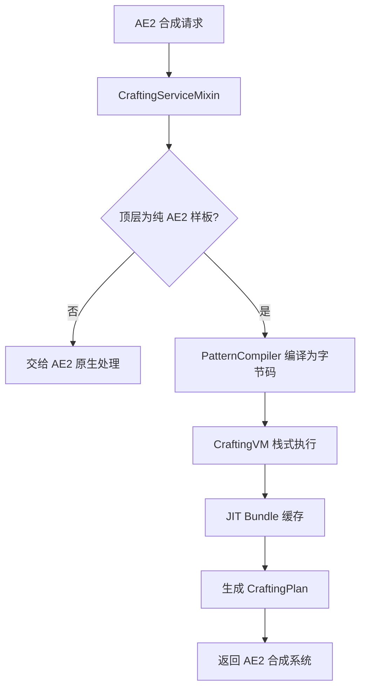

# AE2 VM — AE2 合成虚拟机


> **English version**: [README_en.md](README_en.md)
> **Author**: Tao &nbsp;|&nbsp; **QQ**: 2584300846 &nbsp;|&nbsp; **GitHub**: [AE2-VM](https://github.com/TaoLe-si/AE2-VM)

**AE2 VM** 是 [Applied Energistics 2](https://github.com/AppliedEnergistics/Applied-Energistics-2) 的 NeoForge 扩展模组。它将 AE2 原本的**递归合成树遍历**替换为**栈式虚拟机（Stack-based VM）执行编译后的字节码**，实现合成计算的极限加速。适用于深度嵌套的大型合成配方（如 AE2 扩展包中的无限存储元件）。

---

## 性能

### 实测加速（合成计算耗时）

| 场景 | 原版 AE2 | AE2 VM | 加速比 |
|------|----------|--------|--------|
| 1× quantum_omni_cell_16k | ~90s | ~38ms | **~2,400×** |
| 10^3× quantum_omni_cell_64m | — | ~17ms | — |
| 10^6× quantum_omni_cell_64m | N/A | ~10ms | — |
| 10^6× 递归样板 (1A→1A) | 无法计算 | ~秒算 | — |
| 10^9× creative_ae_cell_long | N/A | ~280ms | — |

> 原版 AE2 使用递归遍历，合成树深度每增加一层，耗时指数增长。VM 将遍历转为顺序字节码执行 + JIT 缓存，达到亚秒级计算。
>
> 加速比列中「—」表示原版 AE2 无基线（无法计算 / 未测量），无法给出加速比；这些场景由 VM 通过 **O(1) 批量回放**、**递归种子注入**、**多线程并行**等方式完成计算。

> **大数量级秒算**：JIT bundle 支持 `scale(cts)` 一次放大，任意数量级（10^6、10^9…）的合成只需一次 apply，O(1) 时间复杂度。

> **递归样板支持**：自引用配方（如 1A→1A）通过 `ignore(what)` 遮蔽目标物品 + 计划后处理矫正（查真实网络库存，种子物品移出 missingItems、加入 usedItems），实现递归样板正常下单。

### 基准测试（闪电基准，33 例）

> 「闪电」= Thunderbolt-Core 参考能力套件，测 AE2VM 计算速度（elapsedMs）+ 能力表面。

```
[reference-capability] SUMMARY cases=33 supported=23 falsePositive=10 engineError=0 timeout=0 totalElapsedMs=66.6
```

- **性能基准**：全部用例 **1.056 – 5.117 ms**，稳态单例 **1–5 ms**，无一例触碰 1s 时限。
- 单配方 DAG（dispersed/fibonacci）、多配方 greedy-trap、自生长环裁切等 23 例 SUPPORTED；
  催化剂/耐久/可复用/多样板最优/换算环差分等 10 例为预期能力边界（FALSE_POSITIVE）。

### 已知限制与后续计划

- ~~**斐波那契数列（指数级递归增长）处理能力不足**~~ → **已解决**：v1.9.8+ 用 **O(patterns+edges) 需求传播聚合**替代逐路径展开，斐波那契式指数递归链不再指数爆炸（24 层 10⁹ 请求秒算）。
- ~~**物品替换 / 流体替换假缺失**（灰羊毛样板 + 白羊毛库存报「缺少灰羊毛」）~~ → **已解决**：v1.9.13 聚合期模糊组库存聚合，替换变体库存满足槽位时不再假缺失（边界基准 37/37 守护）。
- **催化剂 / 耐久 / 可复用库存 / 多样板最优选择 / 换算环差分**：当前按普通消耗品建模，计划交由 AE2 原生处理或由玩家避免使用这类样板（闪电基准 10 例 FALSE_POSITIVE 为预期能力边界）。
- **后续计划**：为上述能力边界提供原生支持。

---

## 测试与基准（2026-08-08，版本 1.10.1）

> 以下数据全部来自本次真实运行（`gradlew.bat test --rerun-tasks --no-daemon`，BUILD SUCCESSFUL），未编造。

### 总览（JUnit 报告统计）

```
测试类: 13    用例: 108    失败: 0    错误: 0    跳过: 0
构建: BUILD SUCCESSFUL
```

| 测试类 | 用例 | 结果 |
|---|---|---|
| Ae2VmReferenceCapabilitySuiteTest（闪电基准） | 34 | ✅ 0 fail |
| Ae2VmBoundaryCapabilitySuiteTest（边界基准） | 38 | ✅ 0 fail |
| CrossRequestCacheTest | 11 | ✅ 0 fail |
| VMTest | 6 | ✅ 0 fail |
| JitReuseTest | 4 | ✅ 0 fail |
| FuzzyGroupRegistrationTest | 3 | ✅ 0 fail |
| FuzzyDiagTest | 3 | ✅ 0 fail |
| FluidBucketBoundaryTest | 2 | ✅ 0 fail |
| QuantityOneBoundaryTest | 2 | ✅ 0 fail |
| StockAwareSubCraftReproTest | 2 | ✅ 0 fail |
| CraftableFluidStockReproTest | 1 | ✅ 0 fail |
| FalsePositiveDiagnosticTest | 1 | ✅ 0 fail |
| VmBridgeSpikeTest | 1 | ✅ 0 fail |

### 闪电基准测试（Thunderbolt-Core 参考能力，33 例）

> 「闪电」= Thunderbolt（雷/闪电）：跑 Thunderbolt-Core 规划器能力参考套件，
> 测 AE2VM 计算速度（elapsedMs）+ 能力表面。11 图族 × 3 材料模式（MISSING/MINIMUM/UNBOUNDED）。

```
[reference-capability] SUMMARY cases=33 supported=23 falsePositive=10 engineError=0 timeout=0 totalElapsedMs=66.6
```

- **SUPPORTED (23)**：单配方 DAG（dispersed / fibonacci 全模式）、多配方 greedy-trap 全模式、
  多配方 fibonacci missing/unbounded、换算环 min/unbounded、自生长环全部、各族 MISSING/UNBOUNDED 模式。
- **FALSE_POSITIVE (10)**：能力边界——多样板最优选择（multi-fibonacci min）、换算环差分（conversion-ring missing）、
  催化剂/耐久/可复用库存的 MINIMUM 模式（VM 按普通消耗品建模）。
- **性能基准**：全部用例 1.056–5.117 ms；稳态单例 1–5 ms；无一例触碰 1s 时限。

### 边界能力基准（37 例）

```
[reference-boundary] SUMMARY cases=37 ok=37 feasible=36 totalElapsedMs=151
```

37/37 与期望可行性一致（36 可行 + 1 不可行 sanity）。守护 v1.9.13 模糊组库存聚合修复：
`craftable-primary-white-stock amt=100 (white=1)` 修复前 `missing={white_wool=99}`（有样板却报缺失）
→ 修复后 `missing={}`（白色库存 1 满足 1 槽位、其余 99 由灰色羊毛合成）。

---

## 工作原理

### 整体架构



### 1. 样板编译（PatternCompiler）

在样板编码时，将所有 AE2 处理样板预先编译为**独立字节码**：

- 每条样板编译为一段字节码序列（`DUP → RECORD_PATTERN → EXTRACT → CALL_BY_KEY → ... → INSERT_OUTPUT → RETURN`）
- 子样板通过 `CALL_BY_KEY` 在运行时懒解析（而非编译时内联）
- 全局缓存（`ConcurrentHashMap`），跨网络共享

### 2. 栈式虚拟机（CraftingVM）

- **BigInteger 栈**：支持无限精度运算，突破 long 上限
- **字节码执行**：顺序执行无递归，极低栈深度开销
- **零分配优化**：0–1023 常用值预分配 BigInteger 缓存
- **快速路径**：2 的幂次 MUL/DIV 使用位移运算

### 3. JIT 缓存（Bundle）

针对合成树中**反复调用相同样板**的瓶颈：

| 机制 | 触发条件 | 原理 |
|------|----------|------|
| **cts=1 记忆化** | 同一样板被多次调用 | 首次执行捕获子树 Δ，后续直接 apply |
| **cts>1 scale 批量回放** | 单次需要多个产物 | `bundle.scale(cts)` 一次放大 → 单次 apply，O(1) |
| **跨 VM 静态缓存** | 多次下单 | bundle 按网络静态缓存，第二次下单直接命中 |


```
示例：需要 1000 个 quantum_component_256m

cts=1000
└─ bundle[0].scale(1000)  →  一次 apply 完成，O(1)
    ├─ used × 1000   （网络提取）
    ├─ internal × 1000（内部轮转）
    └─ emitted × 1000 （产出）
```

### 4. 无限精度

- 栈使用 `BigInteger`，中间值永不溢出
- Bundle 内部使用 `BigInteger` 存储计数
- 最终输出转换到 AE2 的 `long` API 时自动 cap 到 `Long.MAX_VALUE`（9.22×10¹⁸）

---

## 字节码指令集

| Opcode | 值 | 说明 |
|--------|-----|------|
| `PUSH_ITEM` | 0x00 | 压入物品数量 × 倍数 |
| `PUSH_LONG` | 0x01 | 压入 64 位整数 |
| `ADD` | 0x02 | 加法（溢出检测 → BigInteger） |
| `SUB` | 0x03 | 减法（溢出检测 → BigInteger） |
| `MUL` | 0x04 | 乘法（2 的幂次快速路径） |
| `DIV_ROUNDUP` | 0x05 | 向上取整除法 |
| `EXTRACT_INGREDIENT` | 0x06 | 从模拟网络提取原料 |
| `RECORD_OUTPUT` | 0x07 | 记录产出 |
| `RECORD_INGREDIENT` | 0x08 | 记录原料（旧） |
| `RECORD_MISSING` | 0x09 | 记录缺失物品 |
| `DUP` | 0x0A | 复制栈顶 |
| `POP` | 0x0B | 弹出栈顶 |
| `SWAP` | 0x0C | 交换栈顶两个值 |
| `RECORD_PATTERN` | 0x0D | 记录样板执行（用于 AE2 作业调度） |
| `CALL` | 0x0E | 调用编译好的样板字节码 |
| `RETURN` | 0x0F | 返回调用者 |
| `CALL_BY_KEY` | 0x10 | 按物品 Key 懒解析子样板 |
| `INSERT_OUTPUT` | 0x11 | 将产物插入模拟网络 |
| `HALT` | 0xFF | 停止执行，生成计划 |

### 编译产物示例

```
配方: 4×铁锭 → 1×铁块

字节码:
  DUP                   # 复制合成次数
  RECORD_PATTERN iron_block
  DUP                   # 复制合成次数
  PUSH_LONG 4           # 每合成 1 次需 4 铁锭
  MUL                   # 总需铁锭 = 次数 × 4
  EXTRACT iron_ingot    # 尝试从网络获取
  DUP                   # 保留剩余量
  CALL_BY_KEY iron_ingot # 缺失部分调用铁锭样板
  EXTRACT iron_ingot    # 认领刚合成的铁锭（claim）
  POP
  INSERT_OUTPUT iron_block  # 产出铁块
  POP
  RETURN
```

---

## 使用方法

### 安装

1. 安装 [NeoForge](https://neoforged.net/) 与 [Applied Energistics 2 19.2.17+](https://www.curseforge.com/minecraft/mc-mods/applied-energistics-2)
2. 将 `ae2vm-1.10.1.jar` 放入 `mods/` 文件夹（请删除旧版本 jar，仅保留最新版）
   - 无针对检测版请使用 `ae2vm-nodetect-1.10.1.jar`（检测到不兼容作者 mod 时只警告、不闪退）
   - 两个变体 jar 共用 `modId=ae2vm`，**只能保留其中一个**，否则会 duplicate modId 报错
3. 启动游戏，日志出现 `AE2 VM v1.10.1 Loaded!` 即加载成功

### 在游戏中使用

无需任何额外设置，AE2 VM 自动接管纯 AE2 样板的合成计算：

1. 正常编码 AE2 样板（放置到样板供应器即可，编码时自动编译为字节码）
2. 在 ME 终端发起合成请求
3. VM 自动加速计算（无需配置，透明替换原版算法）

**支持的配方**：
- 普通合成样板（分子装配室）
- 处理样板（处理样板供应器 / 扩展处理样板供应器）
- 深层嵌套大型配方（如 AE2 扩展包的无限存储元件）

**注意事项**：
- ECO / 第三方模组样板：自动透传给原生处理，不干扰 ECO 系统
- 合成计算在后台线程执行，不会卡顿服务器主线程

### 第三方模组集成（开发）

第三方合成模组可通过公开 API 调用 AE2 VM 的计算引擎，详见下方「第三方模组调用接口」。

---

## 技术实现

### Mixin 注入层

| Mixin | 目标类 | 注入点 | 作用 |
|-------|--------|--------|------|
| `CraftingServiceMixin` | `CraftingService` | `beginCraftingCalculation` (HEAD) | 拦截合成计算，替换为 VM 执行 |

| `CraftingSimulationStateAccessor` | `CraftingSimulationState` | — | 访问器接口，暴露 bytes 字段 |

### 第三方样板透传

- 顶层为第三方样板（非纯 AE2）时，VM 不接管，交给 AE2 原生处理
- VM 内部不硬编码任何第三方模组，只处理纯 AE2 样板
- 第三方模组可通过公开 API `AE2VMCrafting` 主动调用 VM 计算引擎（见下节）

### simInternal 追踪

VM 自行追踪所有 `INSERT_OUTPUT` 的物品量（`simInternal`）。EXTRACT 时先从内部池扣除，仅余额计入 `usedItems`（真实网络消耗）。确保空网络下 `usedItems=0`。

### 第三方模组调用接口（Public API）—— 可选模组

AE2 VM 设计为第三方模组的**可选模组（optional / soft dependency）**：

- 第三方模组**不需要**依赖 AE2 VM 也能正常运行，未安装 AE2 VM 时自动回退到原生 AE2 合成
- 只有检测到 AE2 VM 已加载时，才调用 VM 计算合成计划
- 使用 `compileOnly`（编译期依赖）+ 运行时 `isLoaded()` 检测，或纯反射调用（零依赖）

VM 内部不接入任何第三方，保持纯 AE2 处理；第三方模组自行决定是否使用 VM。

> **重要**：AE2 VM 的 mixin 只接管 **AE2 自身**（`appeng.*`）和**已注册第三方模组**发起的请求。
> 第三方模组**未注册**时，其请求全部交由该模组**自身的合成逻辑**处理，VM 完全不干预。

#### 0. 注册（决定 VM 是否接管你的样板）

第三方模组若希望 VM 处理自己的样板，必须在启动时（`@Mod` 构造函数中）显式**注册**：

```java
// 在第三方模组的 @Mod 构造函数中调用
AE2VMCraftingRegistry.register("neoecoae");     // 例如 ECO
AE2VMCraftingRegistry.register("extendedae");   // 例如 ExtendedAE
```

```java
// com.ae2vm.addon.api.AE2VMCraftingRegistry.java
public final class AE2VMCraftingRegistry {

    // 注册一个第三方模组（marker 为其类名包含的子串，用于识别 requester）
    public static void register(String marker);

    // 判断某个 requester/provider 类是否属于已注册的第三方模组
    public static boolean isRegistered(String className);

    // 判断 requester 是否属于未注册的第三方模组（AE2 自身 appeng.* 永远返回 false）
    public static boolean isUnregisteredThirdParty(String className);

    // 是否已有任何第三方模组注册
    public static boolean hasRegistrations();
}
```

- **AE2 自身**（类名以 `appeng.` 开头）→ 总是由 VM 计算，无需注册
- **第三方已注册** → 该模组的请求由 VM 计算合成计划
- **第三方未注册** → 该模组的请求走它**自身的合成逻辑**（VM 直接放行）

#### 1. 引入依赖（可选）

第三方模组在 `build.gradle` 中使用 **`compileOnly`**（仅编译期，不打进运行时）：

```gradle
dependencies {
    // 可选依赖：仅编译期需要，运行时可有可无
    compileOnly "com.ae2vm:ae2vm:1.10.1"
}
```

> 也可以完全不声明依赖，直接用下面的**反射方式**调用。

#### 2. 公开 API

```java
// com.ae2vm.addon.api.AE2VMCrafting.java
public final class AE2VMCrafting {

    // 检测 AE2 VM 是否已加载（第三方模组的运行时开关）
    public static boolean isLoaded();

    // 异步计算合成计划（服务器线程推荐使用）
    public static CompletableFuture<ICraftingPlan> calculate(
            IGrid grid,
            ICraftingSimulationRequester requester,
            AEKey what,
            long amount,
            CalculationStrategy strategy);

    // 同步计算合成计划（阻塞直到完成）
    public static ICraftingPlan calculateSync(
            IGrid grid,
            ICraftingSimulationRequester requester,
            AEKey what,
            long amount,
            CalculationStrategy strategy) throws Exception;
}
```

#### 3. 完整集成示例（推荐：compileOnly + isLoaded）

第三方模组在 `@Mod` 构造函数中**注册**，在自己的合成服务中调用 VM 计算，并回退原生：

```java
import com.ae2vm.addon.api.AE2VMCrafting;
import com.ae2vm.addon.api.AE2VMCraftingRegistry;
import net.neoforged.bus.api.IEventBus;
import net.neoforged.fml.common.Mod;

@Mod("mymod")  // 第三方模组自己的 mod id
public class MyMod {
    public MyMod(IEventBus bus) {
        // 1. 注册：让 AE2 VM 接管本模组的合成请求（marker = 本模组类名包含的子串）
        AE2VMCraftingRegistry.register("mymod");
    }
}

public class MyCraftingService {
    private final IGrid grid;

    public CompletableFuture<ICraftingPlan> beginCraftingCalculation(
            ICraftingSimulationRequester requester,
            AEKey what, long amount, CalculationStrategy strategy) {

        // 2. 可选集成：仅当 AE2 VM 已加载时使用
        if (AE2VMCrafting.isLoaded()) {
            CompletableFuture<ICraftingPlan> planFuture =
                AE2VMCrafting.calculate(grid, requester, what, amount, strategy);

            // 3. 拿到 plan 后提交到合成 CPU
            planFuture.thenAccept(plan -> submitToCpu(plan, requester));
            return planFuture;
        }

        // 4. 未安装 AE2 VM：回退到原生 AE2 计算逻辑
        return nativeCalculate(requester, what, amount, strategy);
    }

    // 找到空闲 CPU 并提交任务
    private void submitToCpu(ICraftingPlan plan, ICraftingSimulationRequester requester) {
        for (ICraftingCPU cpu : grid.getCraftingService().getCpus()) {
            if (!cpu.isBusy()) {
                ICraftingSubmitResult result = cpu.submitJob(
                    plan, plan.finalOutput().what(),
                    requester.getActionSource(), requester);
                if (result.successful()) {
                    MyMod.LOGGER.info("Job submitted to CPU: {}", plan.finalOutput());
                    return;
                }
            }
        }
        // 无空闲 CPU，回退到其他处理
        handleNoCpu(plan);
    }
}
```

> 注册与计算是两个独立环节：
> - **注册**（`register`）决定 AE2 VM 的 mixin 是否接管**本模组发起的请求**（未注册则走本模组自身合成）
> - **计算**（`calculate`）是本模组**主动**调用 VM 计算合成计划，两者可独立使用

#### 4. 纯反射方式（零编译依赖）

如果第三方模组不想在 `build.gradle` 声明任何依赖，可用反射调用（未安装 AE2 VM 时同样安全）：

```java
public class VMBridge {
    private static final String API = "com.ae2vm.addon.api.AE2VMCrafting";
    private static Method calculate;

    static {
        try {
            if (net.neoforged.fml.ModList.get().isLoaded("ae2vm")) {
                calculate = Class.forName(API).getMethod("calculate",
                    appeng.api.networking.IGrid.class,
                    appeng.api.networking.crafting.ICraftingSimulationRequester.class,
                    appeng.api.stacks.AEKey.class,
                    long.class,
                    appeng.api.networking.crafting.CalculationStrategy.class);
            }
        } catch (Exception ignored) {
            calculate = null; // AE2 VM 未安装
        }
    }

    public static boolean available() {
        return calculate != null;
    }

    @SuppressWarnings("unchecked")
    public static CompletableFuture<ICraftingPlan> calculate(
            IGrid grid, ICraftingSimulationRequester requester,
            AEKey what, long amount, CalculationStrategy strategy) {
        try {
            return (CompletableFuture<ICraftingPlan>) calculate.invoke(
                null, grid, requester, what, amount, strategy);
        } catch (Exception e) {
            return CompletableFuture.failedFuture(e);
        }
    }
}
```

```java
// 使用
if (VMBridge.available()) {
    VMBridge.calculate(grid, requester, what, amount, strategy)
        .thenAccept(plan -> submitToCpu(plan, requester));
} else {
    nativeCalculate(requester, what, amount, strategy);
}
```

#### 5. 计算流程

```
第三方模组的 beginCraftingCalculation
  ├─ AE2VMCrafting.isLoaded() == false → 回退原生 AE2 计算
  └─ AE2VMCrafting.isLoaded() == true
       └─ 调用 AE2VMCrafting.calculate(grid, requester, what, amount, strategy)
            ├─ 解析顶层样板（纯 AE2）→ 编译为字节码
            ├─ VM 执行（BigInteger 栈 + JIT Bundle 缓存）
            ├─ 生成 CraftingPlan（used/emitted/missing/patternTimes）
            └─ 返回 Future<ICraftingPlan> → 第三方模组自行提交任务
```

#### 注意事项

- **AE2 VM 是可选的**：未安装时第三方模组照常工作，`isLoaded()` 返回 `false`
- 依赖应声明为 `compileOnly`，不要把 AE2 VM 打包进第三方模组，也不要强制玩家安装
- `calculate()` 为异步方法，在后台线程执行，不会阻塞服务器主线程
- `calculateSync()` 会阻塞调用线程，仅在非服务器主线程场景使用
- VM 只处理纯 AE2 样板；无 AE2 样板的物品将计入 `missingItems`，由第三方决定如何处理
- 需要 `IGrid` 的 `CraftingService` 已初始化（网络已连接）
- 若 `grid.getCraftingService()` 返回 null 或物品无样板，返回的 Future 会以异常完成（`CompletableFuture.failedFuture`）
- 计划提交后，由合成 CPU 负责实际执行；第三方模组可自行实现 CPU 分配策略


---

## 项目结构

```
src/main/java/com/ae2vm/addon/
├── AE2VMAddon.java                  # Mod 入口
├── api/
│   └── AE2VMCrafting.java           # 公开 API（第三方模组调用 VM）
├── compiler/
│   └── PatternCompiler.java         # 样板 → 字节码编译器
├── mixin/
│   ├── CraftingServiceMixin.java    # 合成计算拦截 + 按网络编译样板
│   └── CraftingSimulationStateAccessor.java # 访问器
├── vm/
│   ├── CraftingVM.java              # 栈式虚拟机 + JIT
│   ├── CraftingBytecode.java        # 字节码容器
│   └── Opcode.java                  # 指令枚举
└── resources/
    ├── ae2vm.mixins.json            # Mixin 配置
    └── META-INF/
        └── neoforge.mods.toml       # Mod 元数据
```

---

## 模组信息

| 项目 | 值 |
|------|-----|
| Mod ID | `ae2vm` |
| 名称 | AE2 VM |
| 版本 | 1.10.1 |
| 作者 | Tao (QQ: 2584300846) |
| 包名 | `com.ae2vm.addon` |

### 依赖

| 依赖 | 版本 |
|------|------|
| Minecraft | 1.21.1 |
| NeoForge | ≥ 21.1.169 |
| Applied Energistics 2 | ≥ 19.2.17 |
| MixinExtras（编译期） | 0.5.3 |

---

## 构建

```bash
# 设置 Java 21（JDK 21 或 22 均可）
set JAVA_HOME=C:\Users\...\corretto-22.0.2

# 双版本构建（推荐）：版本 +0.0.1 → 构建 crash 版 → 构建 warn 版 → 两个 jar 都复制到 mods
buildBoth.bat

# 或单次构建
.\gradlew.bat -PblockedMode=crash jar copyJarToMods --no-daemon   # 针对检测版
.\gradlew.bat -PblockedMode=warn   jar copyJarToMods --no-daemon   # 无针对检测版

# 输出
# build/libs/ae2vm-<ver>.jar            （针对检测版，检测到不兼容 mod 游戏闪退）
# build/libs/ae2vm-nodetect-<ver>.jar   （无针对检测版，只警告不闪退）
# <ver> = 当前版本（基于 1.9.0，每次编译 +0.0.1；1.9.99 → 构建产物 1.10.0）
```

每次编译 `mod_version` 自动 +0.0.1（基于 1.9.0）。Gradle 任务 `copyJarToMods` 会自动将 JAR 复制到配置的 Minecraft mods 目录（先通过 `cleanOldJars` 删除当前变体的旧版本 jar）。

---

## 更新日志

### v1.10.1（2026-08-08）

- **版本统一**：1.21.1 与 1.20.1 双端版本统一为 1.10.1。
- **测试与基准**：新增综合基准（108 用例全过；闪电基准 33 例 supported=23/falsePositive=10；边界基准 37/37）。详见「测试与基准」章节。

### v1.9.13（2026-08-07）

- **修复**：聚合期模糊组库存聚合 —— 可合成主变体 + 替换变体库存不再假缺失（详见下方 v1.9.12 之补充）。
  - 根因：`applyAggregation` 的 stock-aware 分支只读 `realStockOf(主变体)`，主变体可合成、替换变体有库存时，主变体被全量合成且父 bundle 按每 craft 记录的替换变体 used 被缩放 → 白库存不足 → 假缺失（「有样板却报缺失」+「1x/1b vs 2x/100b 边界」）。
  - 修复：聚合期对该子项求和**整个模糊组**的库存（`PatternCompiler.getFuzzyGroup`），按变体逐个消耗（主变体优先），替换变体 `stockFromNetwork += 整槽需求` 清零父 bundle 的 used[v]，只合成缺口。
  - 新增边界基准套件 `Ae2VmBoundaryCapabilitySuiteTest`（FakeBenchGrid 激活 realStockOf，37 例：craftable-primary-white-stock / partial-gray / no-variant / fuzzy-leaf / deep-chain / craftable-fluid / infeasible sanity）。

### v1.8.1（2026-08-04）

- **新增**：双版本构建（`buildBoth.bat`）—— 每次编译同时产出 `ae2vm-<ver>.jar`（针对检测版）与 `ae2vm-nodetect-<ver>.jar`（无针对检测版）。
- **新增**：blockedmod 检测双模式（crash / warn），由 jar 内 `ae2vm/blockedmode.txt` 决定；针对检测版检测到不兼容作者 mod（data_energistics / mekenergistics / soulplied_energistics）游戏闪退，无针对检测版只警告不闪退。
- **版本**：版本号改为基于 1.8.1，每次编译 `mod_version` +0.0.1。
- **已知限制**：对斐波那契数列（指数级递归增长合成链）处理能力不足，后续将进行高性能版本优化。

### v1.2.16（2026-08-02）

- **修复**：递归样板提示缺少原料无法下单。`ignore(what)` 遮蔽目标物品后，计划后处理检测真实网络库存，种子物品移出 missingItems、加入 usedItems。
- **修复**：样板匹配逻辑——Try 2（dropSecondary）和 Try 3（registry item）仅在样板开启模糊匹配（`getPossibleInputs().length > 1`）时才使用放宽后的 key。
- **修复**：ECO 集成重复执行 VM 计算的问题（AtomicReference 去重 + isDone 清理）。

### v1.2.4（2026-08-02）

- **修复**：流体/桶配方只合成 1 个的问题（如「水桶 + 流体替换」）。
  每次合成输入量改为 `multiplier × possibleInputs[0].amount()`，与 AE2 原生 `CraftingTreeProcess` 完全一致。
  流体配方存在两种编码（`lava:1, multiplier=1000` 与 `lava:1000, multiplier=1`），旧代码只用 multiplier，
  导致第二类编码被低估为 1mb/次，岩浆耗尽后只合出 1 个。

### v1.2.3

- **修复**：TOML 元数据解析崩溃（`MalformedInputException`）。`processResources` 指定
  `filteringCharset = 'UTF-8'`，描述中的 `→` 改为 `->`，避免 Windows GBK 系统下损坏。
- **修复**：合成 CPU 卡在「计算合成」。VM 计算增加 30 秒超时，超时 / 异常 / 空计划时自动回退
  AE2 原生合成（原生回退同样限时 30 秒），全程不阻塞服务器主线程。
- **构建**：新增 `cleanOldJars` 任务，`copyJarToMods` 前自动删除 mods 目录中的旧版本 jar。

### v1.2.2

- **修复**：递归样板（1A→1A）死循环、不加速的问题。
- **修复**：JIT 缓存跨请求不命中（改为按网络静态缓存，二次下单直接命中）。
- **优化**：大数量级合成 O(1) 批量回放（`bundle.scale(cts)`）。
- **新增**：物品模糊匹配（任意羊毛等）与流体模糊匹配。

---

## 许可

LGPL v3 — 参见 [LICENSE](LICENSE)

本项目基于 [GNU LGPLv3](LICENSE) 开源。作为 AE2 的衍生作品，遵循 AE2 的许可协议。
