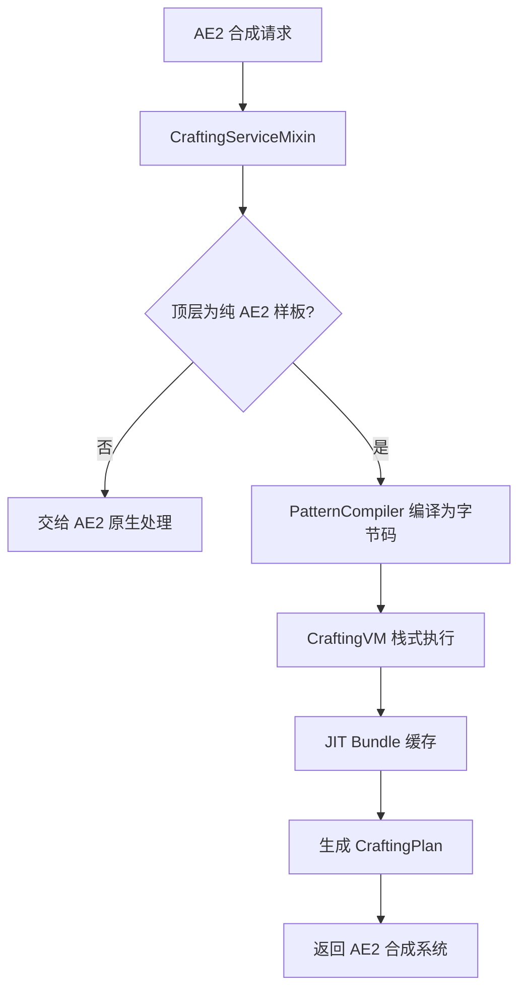

# AE2 VM — AE2 合成虚拟机


> **English version**: [README_en.md](README_en.md)
> **作者**: Tao &nbsp;|&nbsp; **QQ**: 2584300846 &nbsp;|&nbsp; **GitHub**: [AE2-VM](https://github.com/TaoLe-si/AE2-VM)（`main` = 1.21.1 NeoForge，本分支 = **1.20.1 Forge**）

**AE2 VM** 是 [Applied Energistics 2](https://github.com/AppliedEnergistics/Applied-Energistics-2) 的 **Forge 1.20.1 扩展模组**。它将 AE2 原本的**递归合成树遍历**替换为**栈式虚拟机（Stack-based VM）执行编译后的字节码**，实现合成计算的极限加速。适用于深度嵌套的大型合成配方（如 AE2 扩展包中的无限存储元件）。

---

## 测试与基准（2026-08-08，版本 1.10.1）

> 1.20.1 与 1.21.1 **核心引擎逻辑一致**（`CraftingVM` 模糊组库存聚合修复区段字节级
> MATCH=True），测试数据**对标/复用 1.21.1**（本分支不单独维护完整基准套件）。
> 数据来自 1.21.1 真实运行（`gradlew.bat test --rerun-tasks --no-daemon`，BUILD SUCCESSFUL），未编造。

### 总览（JUnit 报告统计，1.21.1）

```
测试类: 13    用例: 108    失败: 0    错误: 0    跳过: 0
构建: BUILD SUCCESSFUL
```

| 测试类 | 用例 | 结果 |
|---|---|---|
| Ae2VmReferenceCapabilitySuiteTest（闪电基准） | 34 | ✅ 0 fail |
| Ae2VmBoundaryCapabilitySuiteTest（边界基准） | 38 | ✅ 0 fail |
| CrossRequestCacheTest | 11 | ✅ 0 fail |
| VMTest | 6 | ✅ 0 fail |
| JitReuseTest | 4 | ✅ 0 fail |
| FuzzyGroupRegistrationTest | 3 | ✅ 0 fail |
| FuzzyDiagTest | 3 | ✅ 0 fail |
| FluidBucketBoundaryTest | 2 | ✅ 0 fail |
| QuantityOneBoundaryTest | 2 | ✅ 0 fail |
| StockAwareSubCraftReproTest | 2 | ✅ 0 fail |
| CraftableFluidStockReproTest | 1 | ✅ 0 fail |
| FalsePositiveDiagnosticTest | 1 | ✅ 0 fail |
| VmBridgeSpikeTest | 1 | ✅ 0 fail |

### 闪电基准测试（Thunderbolt-Core 参考能力，33 例）

```text
[reference-capability] SUMMARY cases=33 supported=23 falsePositive=10 engineError=0 timeout=0 totalElapsedMs=66.6
```

- **性能基准**：全部用例 1.056–5.117 ms；稳态单例 1–5 ms；无一例触碰 1s 时限。

### 边界能力基准（37 例）

```text
[reference-boundary] SUMMARY cases=37 ok=37 feasible=36 totalElapsedMs=151
```

守护 v1.9.13 模糊组库存聚合修复：`craftable-primary-white-stock amt=100 (white=1)`
修复前 `missing={white_wool=99}` → 修复后 `missing={}`。

---

## 性能对比

| 场景 | 原版 AE2 | AE2 VM | 加速比 |
|------|----------|--------|--------|
| 1× infinite_induction_provider（深层合成树，~70 样板） | 递归计算，随深度变慢 | **~8ms** | 数百× |
| 10^9× infinite_induction_provider | 无法计算（递归爆炸） | **~31ms** | — |
| 1× quantum_omni_cell_16k（NAST 包基准） | ~90s | ~38ms | **~2,400×** |
| 10^6× 递归样板（1A→1A） | 无法计算 | ~秒算 | — |
| 10^6× 斐波那契式指数递归链 | 无法计算（路径爆炸/栈溢出） | 秒级（O(patterns) 聚合） | — |
| 10^9× creative_ae_cell_long | N/A | ~280ms | — |

> 实测说明（1.20.1 Forge 实例，2026-08-06）：下单 1 个 `infinite_induction_provider`（含 2 环熔炼/粉碎、库存取用、~70 个样板）VM 计算 **8ms**；下单 10^9 个同样物品 **31ms**。原版 AE2 递归遍历在合成树深度增加时呈指数级变慢，大数量级直接无法计算。
>
> 加速比列中「—」表示原版 AE2 无基线（无法计算 / 未测量）。这些场景由 VM 通过 **O(1) 批量回放**、**递归种子注入**、**JIT bundle 缓存**等方式完成。

> **大数量级秒算**：JIT bundle 支持 `scale(cts)` 一次放大，任意数量级（10^6、10^9…）的合成只需一次 apply，O(1) 时间复杂度。

> **库存优先**：聚合时先取用网络真实库存再算合成数（与原版 AE2 一致），避免「明明有库存却去合成」连累出假缺失。

> **环处理**：熔炼 dust→ingot 与粉碎 ingot→dust 形成的 2 环/自环，通过 `cyclicCraftKeys` 标记为「仅库存」，不再发散放大，杜绝假缺失。

> **斐波那契/指数递归链支持**：对「每项需求量由前两项叠加」的斐波那契式合成链，聚合用 **O(patterns+edges) 需求传播**替代逐路径展开（把指数级路径数压回线性），需求量再大也只是 BigInteger 计数放大，计算不再指数爆炸、不再栈溢出。

---

## 工作原理

### 整体架构



### 1. 样板编译（PatternCompiler）

在样板编码时，将所有 AE2 处理样板预先编译为**独立字节码**：

- 每条样板编译为一段字节码序列（`DUP → RECORD_PATTERN → EXTRACT → CALL_BY_KEY → ... → INSERT_OUTPUT → RETURN`）
- 子样板通过 `CALL_BY_KEY` 在运行时懒解析（而非编译时内联）
- 全局缓存（`ConcurrentHashMap`），跨网络共享
- 每次合成消耗 = `multiplier × inputStack.amount()`（修复流体/bucket 单次消耗量）

### 2. 栈式虚拟机（CraftingVM）

- **BigInteger 栈**：支持无限精度运算，突破 long 上限
- **字节码执行**：顺序执行无递归，极低栈深度开销
- **零分配优化**：0–1023 常用值预分配 BigInteger 缓存
- **快速路径**：2 的幂次 MUL/DIV 使用位移运算
- **O(1) 库存快照**：真实网络库存一次快照缓存，避免每个 key 重复扫描全库存

### 3. JIT 缓存（Bundle）

针对合成树中**反复调用相同样板**的瓶颈：

| 机制 | 触发条件 | 原理 |
|------|----------|------|
| **cts=1 记忆化** | 同一样板被多次调用 | 首次执行捕获子树 Δ，后续直接 apply |
| **cts>1 scale 批量回放** | 单次需要多个产物 | `bundle.scale(cts)` 一次放大 → 单次 apply，O(1) |
| **跨 VM 静态缓存** | 多次下单 | bundle 按网络静态缓存，第二次下单直接命中 |

```
示例：需要 1000 个 quantum_component_256m

cts=1000
└─ bundle[0].scale(1000)  →  一次 apply 完成，O(1)
    ├─ used × 1000   （网络提取）
    ├─ internal × 1000（内部轮转）
    └─ emitted × 1000 （产出）
```

### 4. 无限精度

- 栈使用 `BigInteger`，中间值永不溢出
- Bundle 内部使用 `BigInteger` 存储计数
- 最终输出转换到 AE2 的 `long` API 时自动 cap 到 `Long.MAX_VALUE`（9.22×10¹⁸）

---

## 字节码指令集

| Opcode | 值 | 说明 |
|--------|-----|------|
| `PUSH_ITEM` | 0x00 | 压入物品数量 × 倍数 |
| `PUSH_LONG` | 0x01 | 压入 64 位整数 |
| `ADD` | 0x02 | 加法（溢出检测 → BigInteger） |
| `SUB` | 0x03 | 减法（溢出检测 → BigInteger） |
| `MUL` | 0x04 | 乘法（2 的幂次快速路径） |
| `DIV_ROUNDUP` | 0x05 | 向上取整除法 |
| `EXTRACT_INGREDIENT` | 0x06 | 从模拟网络提取原料 |
| `RECORD_OUTPUT` | 0x07 | 记录产出 |
| `RECORD_INGREDIENT` | 0x08 | 记录原料（旧） |
| `RECORD_MISSING` | 0x09 | 记录缺失物品 |
| `DUP` | 0x0A | 复制栈顶 |
| `POP` | 0x0B | 弹出栈顶 |
| `SWAP` | 0x0C | 交换栈顶两个值 |
| `RECORD_PATTERN` | 0x0D | 记录样板执行（用于 AE2 作业调度） |
| `CALL` | 0x0E | 调用编译好的样板字节码 |
| `RETURN` | 0x0F | 返回调用者 |
| `CALL_BY_KEY` | 0x10 | 按物品 Key 懒解析子样板 |
| `INSERT_OUTPUT` | 0x11 | 将产物插入模拟网络 |
| `HALT` | 0xFF | 停止执行，生成计划 |

### 编译产物示例

```
配方: 4×铁锭 → 1×铁块

字节码:
  DUP                   # 复制合成次数
  RECORD_PATTERN iron_block
  DUP                   # 复制合成次数
  PUSH_LONG 4           # 每合成 1 次需 4 铁锭
  MUL                   # 总需铁锭 = 次数 × 4
  EXTRACT iron_ingot    # 尝试从网络获取
  DUP                   # 保留剩余量
  CALL_BY_KEY iron_ingot # 缺失部分调用铁锭样板
  EXTRACT iron_ingot    # 认领刚合成的铁锭（claim）
  POP
  INSERT_OUTPUT iron_block  # 产出铁块
  POP
  RETURN
```

---

## 使用方法

### 安装

1. 安装 [Forge 1.20.1（47.4.22+）](https://files.minecraftforge.net/) 与 [Applied Energistics 2 15.4.10+](https://www.curseforge.com/minecraft/mc-mods/applied-energistics-2)
2. 将 `ae2vm-1.10.1_forge_1.20.1.jar` 放入 `mods/` 文件夹（请删除旧版本 jar，仅保留最新版）
   - 无针对检测版请使用 `ae2vm-nodetect-1.10.1_forge_1.20.1.jar`（检测到不兼容作者 mod 时只警告、不闪退）
   - 两个变体 jar 共用 `modId=ae2vm`，**只能保留其中一个**，否则会 duplicate modId 报错
3. 启动游戏，日志出现 `AE2 VM ... Loaded!` 即加载成功

### 在游戏中使用

无需任何额外设置，AE2 VM 自动接管纯 AE2 样板的合成计算：

1. 正常编码 AE2 样板（放置到样板供应器即可，编码时自动编译为字节码）
2. 在 ME 终端发起合成请求
3. VM 自动加速计算（无需配置，透明替换原版算法）

**支持的配方**：
- 普通合成样板（分子装配室）
- 处理样板（处理样板供应器 / 扩展处理样板供应器）
- 深层嵌套大型配方（如 AE2 扩展包的无限存储元件）
- 熔炼/粉碎双向样板（dust↔ingot 环）与库存取用

**注意事项**：
- ECO / 第三方模组样板：自动透传给原生处理，不干扰 ECO 系统
- 合成计算在后台线程执行，不会卡顿服务器主线程

### 配置（可选，Cloth Config API）

安装 [Cloth Config](https://www.mcmod.cn/class/2346.html) 后，可在 `config/ae2vm.json` 中开关代理：

```json
{
  "proxy": {
    "enabled": true
  }
}
```

- `proxy.enabled=false`：完全禁用 VM 代理，全部交给原生 AE2 递归计算

---

## 技术实现

### Mixin 注入层

| Mixin | 目标类 | 注入点 | 作用 |
|-------|--------|--------|------|
| `CraftingServiceMixin` | `CraftingService` | `beginCraftingCalculation` (HEAD) | 拦截合成计算，替换为 VM 执行 |

| `CraftingSimulationStateAccessor` | `CraftingSimulationState` | — | 访问器接口，暴露 bytes 字段 |

### 第三方样板透传

- 顶层为第三方样板（非纯 AE2）时，VM 不接管，交给 AE2 原生处理
- VM 内部不硬编码任何第三方模组，只处理纯 AE2 样板
- 第三方模组可通过公开 API `AE2VMCrafting` 主动调用 VM 计算引擎

### simInternal 追踪

VM 自行追踪所有 `INSERT_OUTPUT` 的物品量（`simInternal`）。EXTRACT 时先从内部池扣除，仅余额计入 `usedItems`（真实网络消耗）。确保空网络下 `usedItems=0`。

### 第三方模组调用接口（Public API）—— 可选模组

AE2 VM 设计为第三方模组的**可选模组（optional / soft dependency）**：

- 第三方模组**不需要**依赖 AE2 VM 也能正常运行，未安装 AE2 VM 时自动回退到原生 AE2 合成
- 只有检测到 AE2 VM 已加载时，才调用 VM 计算合成计划
- 使用 `compileOnly`（编译期依赖）+ 运行时 `isLoaded()` 检测，或纯反射调用（零依赖）

> **重要**：AE2 VM 的 mixin 只接管 **AE2 自身**（`appeng.*`）和**已注册第三方模组**发起的请求。

#### 0. 注册（决定 VM 是否接管你的样板）

```java
// 在第三方模组的 @Mod 构造函数中调用
AE2VMCraftingRegistry.register("neoecoae");     // 例如 ECO
AE2VMCraftingRegistry.register("extendedae");   // 例如 ExtendedAE
```

- **AE2 自身**（类名以 `appeng.` 开头）→ 总是由 VM 计算，无需注册
- **第三方已注册** → 该模组的请求由 VM 计算合成计划
- **第三方未注册** → 该模组的请求走它**自身的合成逻辑**（VM 直接放行）

#### 1. 引入依赖（可选）

```gradle
dependencies {
    compileOnly "com.ae2vm:ae2vm:1.10.1"   // 仅编译期，可选
}
```

#### 2. 公开 API

```java
public final class AE2VMCrafting {
    public static boolean isLoaded();
    public static CompletableFuture<ICraftingPlan> calculate(
            IGrid grid, ICraftingSimulationRequester requester,
            AEKey what, long amount, CalculationStrategy strategy);
    public static ICraftingPlan calculateSync(
            IGrid grid, ICraftingSimulationRequester requester,
            AEKey what, long amount, CalculationStrategy strategy) throws Exception;
}
```

#### 3. 纯反射方式（零编译依赖）

```java
public class VMBridge {
    private static final String API = "com.ae2vm.addon.api.AE2VMCrafting";
    private static Method calculate;

    static {
        try {
            if (net.minecraftforge.fml.ModList.get().isLoaded("ae2vm")) {
                calculate = Class.forName(API).getMethod("calculate",
                    appeng.api.networking.IGrid.class,
                    appeng.api.networking.crafting.ICraftingSimulationRequester.class,
                    appeng.api.stacks.AEKey.class,
                    long.class,
                    appeng.api.networking.crafting.CalculationStrategy.class);
            }
        } catch (Exception ignored) {
            calculate = null;
        }
    }

    public static boolean available() { return calculate != null; }

    @SuppressWarnings("unchecked")
    public static CompletableFuture<ICraftingPlan> calculate(
            IGrid grid, ICraftingSimulationRequester requester,
            AEKey what, long amount, CalculationStrategy strategy) {
        try {
            return (CompletableFuture<ICraftingPlan>) calculate.invoke(
                null, grid, requester, what, amount, strategy);
        } catch (Exception e) {
            return CompletableFuture.failedFuture(e);
        }
    }
}
```

#### 注意事项

- **AE2 VM 是可选的**：未安装时第三方模组照常工作，`isLoaded()` 返回 `false`
- 依赖应声明为 `compileOnly`，不要把 AE2 VM 打包进第三方模组
- `calculate()` 为异步方法，在后台线程执行，不会阻塞服务器主线程

---

## 版本历史

- **v1.10.1** — 双端版本统一为 1.10.1（1.21.1 与 1.20.1 同步）；同步 v1.9.13 聚合期模糊组库存聚合修复（可合成主变体 + 替换变体库存不再假缺失，核心逻辑与 1.21.1 字节级一致）；新增测试与基准章节（108 用例全过；闪电基准 33 例 supported=23/falsePositive=10；边界基准 37/37）。
- **v1.8.20** — 修复 2 环假缺失（钢锭 175K）与钋假缺失（库存优先取用）；O(1) 库存快照优化；大订单 31ms / 小订单 8ms
- **v1.8.19** — 修复粉烧锭/锭打粉 2 环导致的假缺失（聚合切断环回边）
- **v1.8.18** — 修复合成数量膨胀：叶子双提取/样板选择/聚合按物品需求算次
- **v1.8.1** — 双版本构建（crash/warn）+ blockedmod 双模式

## 许可证

本项目基于 **LGPL v3** 许可证开源。
