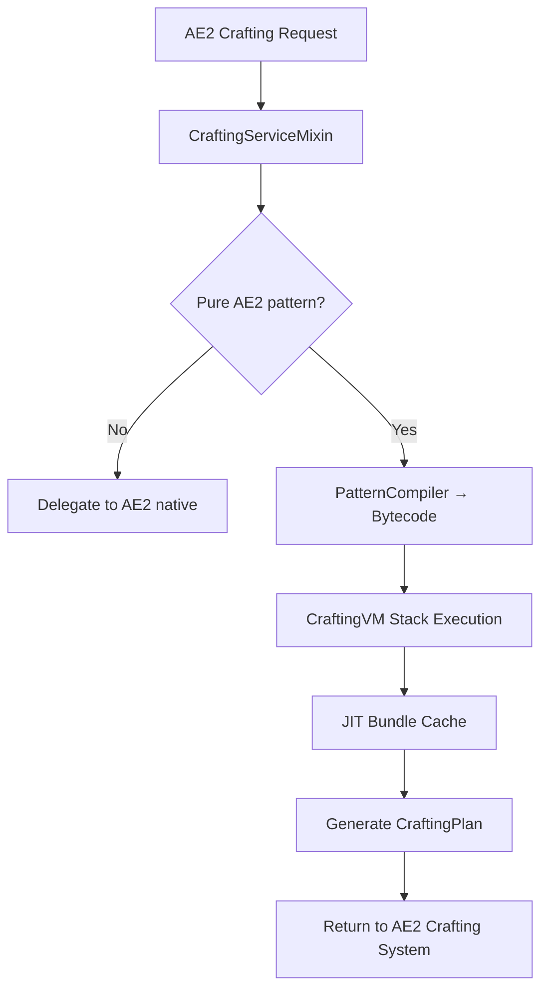

# AE2 VM


> **🇨🇳 中文版本**: [README.md](README.md)
> **Author**: Tao &nbsp;|&nbsp; **QQ**: 2584300846 &nbsp;|&nbsp; **GitHub**: [AE2-VM](https://github.com/TaoLe-si/AE2-VM)（`main` = 1.21.1 NeoForge, this branch = **1.20.1 Forge**）

**AE2 VM** is a **Forge 1.20.1** addon for [Applied Energistics 2](https://github.com/AppliedEnergistics/Applied-Energistics-2) that replaces AE2's recursive crafting tree traversal with a **stack-based virtual machine executing pre-compiled bytecode**, achieving extreme acceleration for crafting calculations. Designed for deeply nested mega-recipes common in AE2 addon packs.

---

## Performance Comparison

| Scenario | Vanilla AE2 | AE2 VM | Speedup |
|----------|-------------|--------|---------|
| 1× infinite_induction_provider (deep tree, ~70 patterns) | recursive, slows with depth | **~8ms** | hundreds× |
| 10^9× infinite_induction_provider | cannot compute (recursive explosion) | **~31ms** | — |
| 1× quantum_omni_cell_16k (NAST pack benchmark) | ~90s | ~38ms | **~2,400×** |
| 10^6× recursive pattern (1A→1A) | cannot compute | ~instant | — |
| 10^6× Fibonacci-style exponential chain | cannot compute (path explosion / stack overflow) | seconds (O(patterns) aggregation) | — |
| 10^9× creative_ae_cell_long | N/A | ~280ms | — |

> Measured on a 1.20.1 Forge instance (2026-08-06): ordering 1× `infinite_induction_provider` (2-cycle smelt/pulverize, stock-aware, ~70 patterns) computes in **8ms**; ordering 10^9 of the same item in **31ms**. Vanilla AE2's recursive traversal slows exponentially with tree depth and cannot compute large quantities at all.
>
> In the Speedup column, "—" means vanilla AE2 has no baseline (cannot compute / not measured); the VM completes these scenarios via **O(1) batch replay**, **recursive seed injection**, and **JIT bundle caching**.

> **Large-quantity instant calculation**: JIT bundles support `scale(cts)` single-pass scaling — any order of magnitude (10^6, 10^9…) needs only one apply, O(1) time.

> **Stock-aware crafting**: the aggregation consumes real network stock before computing craft counts (matching vanilla AE2), avoiding spurious missing from "crafting what is already in stock".

> **Cycle handling**: smelt dust→ingot and pulverize ingot→dust 2-cycles / self-loops are marked `cyclicCraftKeys` (stock-only) so they never diverge into false missing.

> **Fibonacci / exponential recursive chain support**: for recipes whose demand grows like the Fibonacci sequence, the aggregation uses **O(patterns+edges) demand propagation** instead of per-path expansion (collapsing exponential path counts back to linear). No matter how large the demand grows, it is just BigInteger scaling — the calculation no longer explodes or stack-overflows.

---

## How It Works

### Architecture



### 1. Pattern Compilation (PatternCompiler)

At pattern encoding time, all AE2 processing patterns are pre-compiled into **standalone bytecode**:

- Each pattern compiles to a bytecode sequence (`DUP → RECORD_PATTERN → EXTRACT → CALL_BY_KEY → ... → INSERT_OUTPUT → RETURN`)
- Sub-patterns are resolved lazily at runtime via `CALL_BY_KEY` (not inlined at compile time)
- Global cache (`ConcurrentHashMap`), shared across all grids
- Per-craft consumption = `multiplier × inputStack.amount()` (fixes fluid/bucket per-craft amounts)

### 2. Stack-Based VM (CraftingVM)

- **BigInteger stack**: unlimited precision, breaking the `long` ceiling
- **Sequential bytecode execution**: no recursion overhead, minimal stack depth
- **Zero-allocation optimization**: BigInteger cache for values 0–1023
- **Fast paths**: bit-shift for power-of-2 MUL/DIV operations
- **O(1) stock snapshot**: real network inventory snapshotted once and cached, instead of re-scanning per key

### 3. JIT Caching (Bundle)

Targets the bottleneck of **repeated identical sub-pattern calls** in crafting trees:

| Mechanism | Trigger | Principle |
|-----------|---------|-----------|
| **cts=1 Memoization** | Same pattern called repeatedly | First execution captures subtree Δ; subsequent calls apply directly |
| **cts>1 scale replay** | Need multiple outputs per call | `bundle.scale(cts)` scales once → single apply, O(1) |
| **Cross-VM static cache** | Multiple orders | bundles cached per network; second order hits directly |

```
Example: need 1000 quantum_component_256m

cts=1000
└─ bundle[0].scale(1000)  →  single apply, O(1)
    ├─ used × 1000    (network extract)
    ├─ internal × 1000 (internal turnover)
    └─ emitted × 1000 (produced)
```

### 4. Unlimited Precision

- Stack uses `BigInteger` — intermediate values never overflow
- Bundles store counts with `BigInteger`
- Final output caps at `Long.MAX_VALUE` (9.22×10¹⁸) when converting to AE2's `long` API

---

## Bytecode Instruction Set

| Opcode | Value | Description |
|--------|-------|-------------|
| `PUSH_ITEM` | 0x00 | Push item count × multiplier |
| `PUSH_LONG` | 0x01 | Push 64-bit integer |
| `ADD` | 0x02 | Addition (overflow → BigInteger) |
| `SUB` | 0x03 | Subtraction (overflow → BigInteger) |
| `MUL` | 0x04 | Multiplication (power-of-2 fast path) |
| `DIV_ROUNDUP` | 0x05 | Ceiling division |
| `EXTRACT_INGREDIENT` | 0x06 | Extract ingredient from simulated network |
| `RECORD_OUTPUT` | 0x07 | Record output |
| `RECORD_INGREDIENT` | 0x08 | Record ingredient (legacy) |
| `RECORD_MISSING` | 0x09 | Record missing item |
| `DUP` | 0x0A | Duplicate stack top |
| `POP` | 0x0B | Pop stack top |
| `SWAP` | 0x0C | Swap top two values |
| `RECORD_PATTERN` | 0x0D | Record pattern execution (for AE2 job scheduling) |
| `CALL` | 0x0E | Call compiled pattern bytecode |
| `RETURN` | 0x0F | Return to caller |
| `CALL_BY_KEY` | 0x10 | Lazily resolve sub-pattern by item key |
| `INSERT_OUTPUT` | 0x11 | Insert produced output into simulated network |
| `HALT` | 0xFF | Stop execution, generate plan |

### Compiled Example

```
Recipe: 4× iron_ingot → 1× iron_block

Bytecode:
  DUP                   # duplicate craft count
  RECORD_PATTERN iron_block
  DUP                   # duplicate craft count
  PUSH_LONG 4           # 4 iron_ingot per craft
  MUL                   # total needed = count × 4
  EXTRACT iron_ingot    # try to extract from network
  DUP                   # keep residual
  CALL_BY_KEY iron_ingot # call iron_ingot pattern for shortfall
  EXTRACT iron_ingot    # claim crafted iron_ingot
  POP
  INSERT_OUTPUT iron_block  # produce iron_block
  POP
  RETURN
```

---

## Usage

### Installation

1. Install [Forge 1.20.1 (47.4.22+)](https://files.minecraftforge.net/) and [Applied Energistics 2 15.4.10+](https://www.curseforge.com/minecraft/mc-mods/applied-energistics-2)
2. Put `ae2vm-1.8.20_forge_1.20.1.jar` into the `mods/` folder (remove old versions)
   - Use `ae2vm-nodetect-1.8.20_forge_1.20.1.jar` for the no-detect variant (warns instead of crashing on incompatible author mods)
   - Both variants share `modId=ae2vm` — **keep only one**, otherwise duplicate modId errors
3. Launch the game; the log shows `AE2 VM ... Loaded!` on success

### In-Game

No extra setup needed — AE2 VM automatically takes over pure-AE2 crafting calculations:

1. Encode AE2 patterns as usual (auto-compiled to bytecode on encoding)
2. Request a craft from the ME terminal
3. The VM accelerates the calculation transparently

**Supported recipes**:
- Standard crafting patterns (molecular assembler)
- Processing patterns (processing pattern provider / extended)
- Deeply nested large recipes (e.g. infinite storage cells from AE2 addons)
- Smelt/pulverize two-way patterns (dust↔ingot cycles) and stock-aware crafting

**Notes**:
- ECO / third-party mod patterns are passed through to native handling
- Calculation runs on a background thread — no server main-thread stutter

### Configuration (optional, Cloth Config API)

With [Cloth Config](https://www.mcmod.cn/class/2346.html) installed, `config/ae2vm.json` can toggle the proxy:

```json
{
  "proxy": {
    "enabled": true
  }
}
```

- `proxy.enabled=false`: fully disables the VM proxy, delegating to native AE2 recursive calculation

---

## Technical Implementation

### Mixin Layer

| Mixin | Target | Injection | Purpose |
|-------|--------|-----------|---------|
| `CraftingServiceMixin` | `CraftingService` | `beginCraftingCalculation` (HEAD) | Intercept crafting calculation, replace with VM |

| `CraftingSimulationStateAccessor` | `CraftingSimulationState` | — | Accessor interface exposing the bytes field |

### Third-Party Pattern Passthrough

- When the top-level pattern is third-party (non-pure AE2), the VM does not take over
- The VM never hard-codes any third-party mod — only pure AE2 patterns
- Third-party mods can call the public `AE2VMCrafting` API to use the VM engine

### simInternal Tracking

The VM tracks all `INSERT_OUTPUT` amounts (`simInternal`). EXTRACT deducts from the internal pool first; only the balance counts toward `usedItems` (real network consumption), so an empty network yields `usedItems=0`.

### Third-Party Integration (Public API) — optional

AE2 VM is an **optional / soft dependency**:

- Third-party mods work without AE2 VM; they fall back to native AE2 crafting when it is absent
- Use `compileOnly` + runtime `isLoaded()` detection, or pure reflection (zero dependency)

> **Important**: AE2 VM's mixin only takes over requests from **AE2 itself** (`appeng.*`) and **registered third-party mods**.

#### 0. Register (decides whether VM takes over your patterns)

```java
// Call in your @Mod constructor
AE2VMCraftingRegistry.register("neoecoae");     // e.g. ECO
AE2VMCraftingRegistry.register("extendedae");   // e.g. ExtendedAE
```

- **AE2 itself** (class starts with `appeng.`) → always computed by the VM
- **Registered third-party** → VM computes its plans
- **Unregistered third-party** → its own crafting logic (VM passes through)

#### 1. Optional Dependency

```gradle
dependencies {
    compileOnly "com.ae2vm:ae2vm:1.8.20"   // compile-time only, optional
}
```

#### 2. Public API

```java
public final class AE2VMCrafting {
    public static boolean isLoaded();
    public static CompletableFuture<ICraftingPlan> calculate(
            IGrid grid, ICraftingSimulationRequester requester,
            AEKey what, long amount, CalculationStrategy strategy);
    public static ICraftingPlan calculateSync(
            IGrid grid, ICraftingSimulationRequester requester,
            AEKey what, long amount, CalculationStrategy strategy) throws Exception;
}
```

#### 3. Pure Reflection (zero compile dependency)

```java
public class VMBridge {
    private static final String API = "com.ae2vm.addon.api.AE2VMCrafting";
    private static Method calculate;

    static {
        try {
            if (net.minecraftforge.fml.ModList.get().isLoaded("ae2vm")) {
                calculate = Class.forName(API).getMethod("calculate",
                    appeng.api.networking.IGrid.class,
                    appeng.api.networking.crafting.ICraftingSimulationRequester.class,
                    appeng.api.stacks.AEKey.class,
                    long.class,
                    appeng.api.networking.crafting.CalculationStrategy.class);
            }
        } catch (Exception ignored) {
            calculate = null;
        }
    }

    public static boolean available() { return calculate != null; }

    @SuppressWarnings("unchecked")
    public static CompletableFuture<ICraftingPlan> calculate(
            IGrid grid, ICraftingSimulationRequester requester,
            AEKey what, long amount, CalculationStrategy strategy) {
        try {
            return (CompletableFuture<ICraftingPlan>) calculate.invoke(
                null, grid, requester, what, amount, strategy);
        } catch (Exception e) {
            return CompletableFuture.failedFuture(e);
        }
    }
}
```

#### Notes

- **AE2 VM is optional**: without it, third-party mods work as usual (`isLoaded()` returns `false`)
- Declare dependencies as `compileOnly`; do not bundle AE2 VM into third-party mods
- `calculate()` is async and runs on a background thread — no server main-thread blocking

---

## Changelog

- **v1.8.20** — Fix 2-cycle false missing (175K steel ingots) and polonium false missing (stock-aware crafting); O(1) stock snapshot optimization; large order 31ms / small order 8ms
- **v1.8.19** — Fix 2-cycle false missing from dust→ingot / ingot→dust patterns (cut cycle back-edges in aggregation)
- **v1.8.18** — Fix craft-count explosion: leaf double-extract / pattern selection / aggregation by item demand
- **v1.8.1** — Dual-variant build (crash/warn) + blockedmod dual modes

## License

Licensed under **LGPL v3**.
