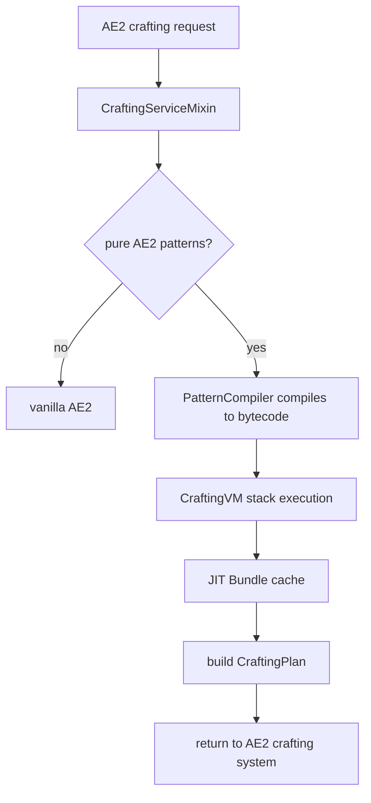

# AE2 VM — Stack-based crafting virtual machine for AE2


> **🇨🇳 中文版本**: [README.md](README.md)
> **Author**: Tao &nbsp;|&nbsp; **QQ**: 2584300846 &nbsp;|&nbsp; **GitHub**: [AE2-VM](https://github.com/TaoLe-si/AE2-VM)

**AE2 VM** is a Forge addon for [Applied Energistics 2](https://github.com/AppliedEnergistics/Applied-Energistics-2) that replaces AE2's recursive crafting tree traversal with a **stack-based virtual machine executing pre-compiled bytecode**, achieving extreme acceleration for crafting calculations. Designed for deeply nested mega-recipes common in AE2 addon packs.

---

## Performance

| Scenario | Vanilla AE2 | AE2 VM | Speedup |
|----------|-------------|--------|---------|
| 1× quantum_omni_cell_16k | ~90s | ~38ms | **~2,400×** |
| 10^3× quantum_omni_cell_64m | — | ~17ms | — |
| 10^6× quantum_omni_cell_64m | N/A | ~10ms | — |
| 10^6× recursive pattern (1A→1A) | cannot compute | ~instant | — |
| 10^9× creative_ae_cell_long | N/A | ~280ms | — |

> Vanilla AE2 uses recursive traversal — each additional depth layer causes exponential slowdown. The VM converts traversal to sequential bytecode execution with JIT caching, achieving sub-second calculation even for billion-item orders. "—" means vanilla AE2 has no baseline.

---

## Capabilities & Fixes (v1.10.x)

- **Recursive / self-referential patterns (v1.10.3)**: `A+B→2A` amplifier and `A+B→A+C` essence-catalyst — self-output offsets self-consumption; the self key collapses to a one-time seed and the primary-output craft count is corrected by the net gain. A missing seed is reported exactly.
- **Conversion-ring conservation (v1.10.3)**: byproduct-free pure exchange rings (`9B→A, 1A→9B, …`) are value-conserving — BigInteger fractions compute the exact ring value; shortfall is reported on the smallest-value demanded key (closes the dangerous seedless-ring false positive).
- **Catalyst feedback-loop working capital (v1.10.2)**: exact minimum seed for byproduct-closed loops.
- **Durability tools (v1.10.2)**: finite-use tools (`amount × ceil(times/uses)` closed form).
- **Processing-recipe default fuzzy (v1.10.2)**: processing inputs match the item's full fuzzy family (any NBT) against network stock (GTL greenhouse / MA essence).
- **Reusable-stock seed fuzzy (v1.10.3)**: host-private reusable-stock routes (`returnedFrom`) match variant stock by fuzzy family.
- **Replacement only for replacement slots (v1.10.5)**: item/fluid replacement groups satisfy only slots with replacement enabled; an EXACT slot (single variant) is forced to be satisfied by the primary key's stock or by crafting the primary, and reports missing correctly for exact leaf slots. Fixes the 2026-08-09 video false-positive bug where the plan looked complete but the CPU execution stalled (zero progress / exploding ETA).
- **Fibonacci exponential chains (v1.9.8+)**: O(patterns+edges) demand-propagation aggregation replaces per-path expansion — 24-level 10⁹ requests compute in seconds.
- **Fuzzy-group stock aggregation (v1.9.13)**: the whole group's stock is summed at aggregation; stocked substitutes no longer cause false missing.

---

## Tests & Benchmark (version 1.10.7)

> Data from `gradlew.bat cleanTest test --no-daemon` (BUILD SUCCESSFUL), not fabricated.

```
Test classes: 18    Cases: 136    Failures: 0    Errors: 0    Skipped: 0
Build: BUILD SUCCESSFUL
Lightning benchmark: cases=39 supported=38 falsePositive=1 engineError=0 timeout=0
Boundary benchmark:  cases=37 ok=37 feasible=36
```

### Lightning benchmark (Thunderbolt-Core reference capability, 39 cases)

13 graph families × 3 material modes (MISSING / MINIMUM / UNBOUNDED), all 13 families SUPPORTED:

| Family | Status |
|---|---|
| Single-pattern DAG (dispersed / fibonacci) | ✅ SUPPORTED |
| Multi-pattern DAG (greedy-trap / fibonacci) | ✅ SUPPORTED (fibonacci/minimum is the only FALSE_POSITIVE) |
| Cycle cutting (conversion-ring / self-growth-cut) | ✅ SUPPORTED |
| Catalyst / feedback loops (returned-seed / raw / lossy) | ✅ 9/9 SUPPORTED |
| Durability chain (finite-use-chain) | ✅ 3/3 SUPPORTED |
| Fuzzy / reusable stock (variant-route) | ✅ 3/3 SUPPORTED |
| Recursion / self-reference (amplifier / essence-catalyst) | ✅ 6/6 SUPPORTED |

> The only remaining FALSE_POSITIVE: `multi-dag/fibonacci/minimum` (optimal multi-pattern selection needs a global optimizer — BoundedCombinations / linear solver), not an engine error.

### Boundary benchmark (37 cases)

`craftable-primary-white-stock amt=100 (white=1)`: before the fix `missing={white_wool=99}`, after `missing={}`; all 37 cases match expected feasibility (36 feasible + 1 infeasible sanity).

---

## How It Works



- **Pattern compilation**: every AE2 pattern is pre-compiled to bytecode at encode time (`DUP → RECORD_PATTERN → EXTRACT → CALL_BY_KEY → … → INSERT_OUTPUT → RETURN`); sub-patterns resolve lazily at runtime; global cache.
- **Stack VM**: BigInteger stack (unlimited precision); sequential execution, no recursion; pre-allocated 0–1023 cache; bit-shift fast path for powers of two.
- **JIT Bundle cache**: cts=1 memoization (reuse subtree Δ), cts>1 `scale(cts)` O(1) batch replay, cross-request static cache.
- **Unlimited precision**: intermediate values never overflow; outputs cap to `Long.MAX_VALUE` at the AE2 long API.

## Opcode Instruction Set

| Opcode | Value | Description |
|--------|-------|-------------|
| `PUSH_ITEM` | 0x00 | push item amount × multiplier |
| `PUSH_LONG` | 0x01 | push 64-bit literal |
| `ADD` | 0x02 | add (overflow → BigInteger) |
| `SUB` | 0x03 | subtract (overflow → BigInteger) |
| `MUL` | 0x04 | multiply (fast path for powers of two) |
| `DIV_ROUNDUP` | 0x05 | ceil division |
| `EXTRACT_INGREDIENT` | 0x06 | extract ingredients from simulated network |
| `RECORD_OUTPUT` | 0x07 | record output |
| `RECORD_INGREDIENT` | 0x08 | record ingredient (legacy) |
| `RECORD_MISSING` | 0x09 | record missing item |
| `DUP` | 0x0A | duplicate stack top |
| `POP` | 0x0B | pop stack top |
| `SWAP` | 0x0C | swap top two values |
| `RECORD_PATTERN` | 0x0D | record pattern execution (AE2 job scheduling) |
| `CALL` | 0x0E | call compiled pattern bytecode |
| `RETURN` | 0x0F | return to caller |
| `CALL_BY_KEY` | 0x10 | lazily resolve sub-pattern by item key |
| `INSERT_OUTPUT` | 0x11 | insert output into simulated network |
| `CATALYST_SEED` | 0x12 | record one-time catalyst/container seed demand |
| `DURABILITY_TOOL` | 0x13 | record finite-use tool demand |
| `FUZZY_SLOT` | 0x14 | mark next CALL_BY_KEY as a replacement slot |
| `HALT` | 0xFF | stop and build the plan |

---

## Usage

### Installation

1. Install [Forge](https://files.minecraftforge.net/) and [Applied Energistics 2 15.4.10+](https://www.curseforge.com/minecraft/mc-mods/applied-energistics-2).
2. Put `ae2vm-1.10.7.jar` into `mods/` (remove old versions).
   - The no-detection build is `ae2vm-nodetect-1.10.7.jar` (warns instead of crashing on incompatible author mods).
   - Both variants share `modId=ae2vm` — keep only ONE, or you'll get a duplicate modId error.
3. Launch the game; the AE2 VM banner in the log means it loaded.

### In-game

No setup required — AE2 VM transparently takes over pure-AE2 crafting calculation:

1. Encode AE2 patterns (they are compiled to bytecode automatically).
2. Request a craft from the ME terminal.
3. The VM accelerates the calculation transparently.

**Config toggle** (optional, requires Cloth Config API): set `proxy.enabled=false` in `config/ae2vm.json` to fully disable the VM proxy.

**Supported recipes**: crafting patterns (molecular assembler), processing patterns, deeply nested mega-recipes (e.g. AE2 addon infinite-storage cells).

**Notes**: ECO / third-party patterns pass through to native handling; calculation runs on a background thread (no server main-thread lag).

---

## Third-party Integration (Developers)

Third-party crafting mods can call the AE2 VM engine through the public API (optional dependency, `compileOnly`):

```java
import com.ae2vm.addon.api.AE2VMCrafting;
import com.ae2vm.addon.api.AE2VMCraftingRegistry;

// Register in the third-party @Mod constructor (marker = substring of class name)
AE2VMCraftingRegistry.register("mymod");

// Optional integration: use only when AE2 VM is loaded, else fall back to native
if (AE2VMCrafting.isLoaded()) {
    CompletableFuture<ICraftingPlan> plan = AE2VMCrafting.calculate(
        grid, requester, what, amount, strategy);
    plan.thenAccept(p -> submitToCpu(p, requester));
} else {
    nativeCalculate(requester, what, amount, strategy);
}
```

- `register(...)` decides whether the mixin takes over requests from your mod; `calculate(...)` is how you actively use the VM.
- AE2 itself (`appeng.*`) is always handled by the VM; unregistered third-party mods keep their own crafting logic.
- Declare the dependency as `compileOnly`; when AE2 VM is absent `isLoaded()` returns `false` and your mod works unchanged.
- `calculate()` is async (background thread); `calculateSync()` blocks the calling thread — use only off the server main thread.

---

## Project Structure

```
src/main/java/com/ae2vm/addon/
├── AE2VMAddon.java                  # Mod entry (blockedmod check / banner)
├── api/
│   ├── AE2VMCrafting.java           # public API for third-party mods
│   └── AE2VMCraftingRegistry.java   # third-party registration
├── compiler/
│   ├── PatternCompiler.java         # pattern → bytecode compiler
│   └── IFiniteUseInput.java         # finite-use tool capability
├── config/
│   ├── AE2VMConfig.java             # config entry (proxy.enabled toggle)
│   ├── AE2VMConfigData.java
│   └── AE2VMConfigImpl.java         # Cloth Config implementation
├── mixin/
│   ├── CraftingServiceMixin.java    # crafting calculation interception
│   ├── PatternProviderLogicMixin.java # pattern precompilation
│   └── CraftingSimulationStateAccessor.java
├── vm/
│   ├── CraftingVM.java              # stack VM + JIT
│   ├── CraftingBytecode.java
│   ├── Opcode.java
│   └── RealtimeNetworkCraftingSimulationState.java
└── resources/
    ├── ae2vm.png                    # mod icon
    ├── ae2vm.mixins.json
    └── META-INF/mods.toml           # mod metadata
```

---

## Mod Info

| Item | Value |
|------|-------|
| Mod ID | `ae2vm` |
| Name | AE2 VM |
| Version | 1.10.7 |
| Author | Tao (QQ: 2584300846) |
| Package | `com.ae2vm.addon` |

### Dependencies

| Dependency | Version |
|------------|---------|
| Minecraft | 1.20.1 |
| Forge | ≥ 47.4.22 |
| Applied Energistics 2 | ≥ 15.4.10 |
| Cloth Config API (optional) | 14.x |

---

## Building

```bash
set JAVA_HOME=C:\Users\...\corretto-22.0.2

# Dual build (recommended): version +0.0.1 → crash build → warn build → both jars to mods
buildBoth.bat

# Single build
.\gradlew.bat -PblockedMode=crash jar copyJarToMods --no-daemon   # detection build
.\gradlew.bat -PblockedMode=warn   jar copyJarToMods --no-daemon   # no-detection build

# Output (<ver> = current version, e.g. 1.10.7)
# build/libs/ae2vm-<ver>.jar            (crashes the game if an incompatible author mod is loaded)
# build/libs/ae2vm-nodetect-<ver>.jar   (only warns)
```

> Each build bumps `mod_version` by +0.0.1 (based on 1.9.0). `copyJarToMods` removes old jars first.
