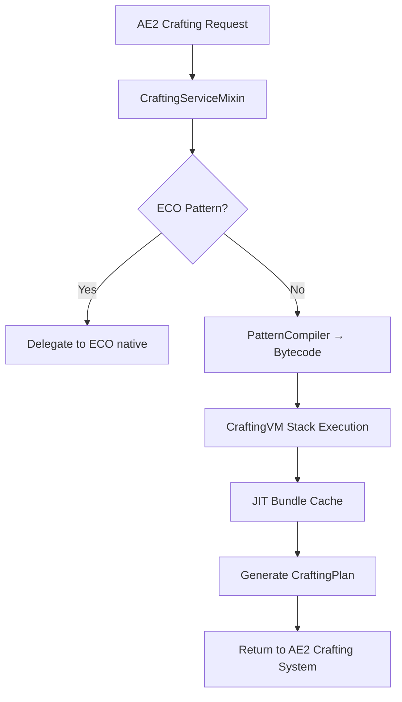

# AE2 VM


> **🇨🇳 中文版本**: [README.md](README.md)
> **Author**: Tao &nbsp;|&nbsp; **QQ**: 2584300846 &nbsp;|&nbsp; **GitHub**: [AE2-VM](https://github.com/TaoLe-si/AE2-VM)

**AE2 VM** is a NeoForge addon for [Applied Energistics 2](https://github.com/AppliedEnergistics/Applied-Energistics-2) that replaces AE2's recursive crafting tree traversal with a **stack-based virtual machine executing pre-compiled bytecode**, achieving extreme acceleration for crafting calculations. Designed for deeply nested mega-recipes common in AE2 addon packs.

---

## Performance

| Scenario | Vanilla AE2 | AE2 VM | Speedup |
|----------|-------------|--------|---------|
| 1× quantum_omni_cell_16k | ~90s | ~38ms | **~2,400×** |
| 10^3× quantum_omni_cell_64m | — | ~17ms | — |
| 10^6× quantum_omni_cell_64m | N/A | ~10ms | — |
| 10^6× recursive pattern (1A→1A) | cannot compute | ~instant | — |
| 10^9× creative_ae_cell_long | N/A | ~280ms | — |

> Vanilla AE2 uses recursive tree traversal — each additional depth layer causes exponential slowdown. The VM converts traversal to sequential bytecode execution with JIT caching, achieving sub-second calculation even for billion-item orders.
>
> In the Speedup column, "—" means vanilla AE2 has no baseline (cannot compute / not measured), so no speedup ratio is given; the VM completes these scenarios via **O(1) batch replay**, **recursive seed injection**, and **multi-threaded parallelism**.

---

## How It Works

### Architecture



### 1. Pattern Compilation (PatternCompiler)

At pattern encoding time, all AE2 processing patterns are pre-compiled into **standalone bytecode**:

- Each pattern compiles to a bytecode sequence (`DUP → RECORD_PATTERN → EXTRACT → CALL_BY_KEY → ... → INSERT_OUTPUT → RETURN`)
- Sub-patterns are resolved lazily at runtime via `CALL_BY_KEY` (not inlined at compile time)
- Global cache (`ConcurrentHashMap`), shared across all grids

### 2. Stack-Based VM (CraftingVM)

- **BigInteger stack**: unlimited precision, breaking the `long` ceiling
- **Sequential bytecode execution**: no recursion overhead, minimal stack depth
- **Zero-allocation optimization**: BigInteger cache for values 0–1023
- **Fast paths**: bit-shift for power-of-2 MUL/DIV operations

### 3. JIT Caching (Bundle)

Targets the bottleneck of **repeated identical sub-pattern calls** in crafting trees:

| Mechanism | Trigger | Principle |
|-----------|---------|-----------|
| **cts=1 Memoization** | Same pattern called repeatedly | First execution captures subtree Δ; subsequent calls apply directly |
| **cts>1 Binary Decomposition** | Need multiple outputs per call | Decompose by 2^k; bundle[k] = bundle[k-1] × 2 |
| **revert/apply** | Dispatch to create bundle | Sandbox execution → capture Δ → revert → binary replay |

```
Example: need 64× quantum_component_256m

cts=64 = 0b1000000
├─ bundle[0] = 1 execution (sandbox captures subtree Δ)
├─ bundle[1] = bundle[0] × 2
├─ bundle[2] = bundle[1] × 2
│  ...
└─ bundle[6] = bundle[5] × 2  →  apply directly, no re-execution
```

### 4. Unlimited Precision

- Stack uses `BigInteger` — intermediate values never overflow
- Bundle internally stores counts as `BigInteger`
- Final output converted to AE2's `long` API; capped at `Long.MAX_VALUE` (9.22×10¹⁸) if exceeded

---

## Bytecode Instruction Set

| Opcode | Value | Description |
|--------|-------|-------------|
| `PUSH_ITEM` | 0x00 | Push item quantity × multiplier |
| `PUSH_LONG` | 0x01 | Push 64-bit integer |
| `ADD` | 0x02 | Addition (overflow → BigInteger) |
| `SUB` | 0x03 | Subtraction (overflow → BigInteger) |
| `MUL` | 0x04 | Multiply (power-of-2 fast path) |
| `DIV_ROUNDUP` | 0x05 | Ceiling division |
| `EXTRACT_INGREDIENT` | 0x06 | Extract ingredient from simulated network |
| `RECORD_OUTPUT` | 0x07 | Record output |
| `RECORD_INGREDIENT` | 0x08 | Record ingredient (legacy) |
| `RECORD_MISSING` | 0x09 | Record missing item |
| `DUP` | 0x0A | Duplicate top of stack |
| `POP` | 0x0B | Pop top of stack |
| `SWAP` | 0x0C | Swap top two stack values |
| `RECORD_PATTERN` | 0x0D | Record pattern execution (for AE2 job scheduling) |
| `CALL` | 0x0E | Call pre-compiled pattern bytecode |
| `RETURN` | 0x0F | Return to caller |
| `CALL_BY_KEY` | 0x10 | Lazy-resolve sub-pattern by item key |
| `INSERT_OUTPUT` | 0x11 | Insert produced item into simulated network |
| `HALT` | 0xFF | Stop execution, build plan |

### Compiled Bytecode Example

```
Recipe: 4× iron_ingot → 1× iron_block

Bytecode:
  DUP                   # Duplicate craft count
  RECORD_PATTERN iron_block
  DUP                   # Duplicate craft count
  PUSH_LONG 4           # 4 ingots per craft
  MUL                   # Total ingots needed = count × 4
  EXTRACT iron_ingot    # Try to get from network
  DUP                   # Keep remaining amount
  CALL_BY_KEY iron_ingot # Craft missing ingots
  EXTRACT iron_ingot    # Claim crafted ingots
  POP
  INSERT_OUTPUT iron_block  # Produce iron block
  POP
  RETURN
```

---

## Technical Implementation

### Mixin Injection Points

| Mixin | Target Class | Injection | Purpose |
|-------|-------------|-----------|---------|
| `CraftingServiceMixin` | `CraftingService` | `beginCraftingCalculation` (HEAD) | Intercept crafting calculation, replace with VM |
| `CraftingServiceMixin` | `CraftingService` | `submitJob` (HEAD) | Submit ECO crafting jobs |
| `PatternProviderLogicMixin` | removed | — | Pattern compilation is handled by `CraftingServiceMixin` with a per-network cache |
| `CraftingSimulationStateAccessor` | `CraftingSimulationState` | — | Accessor interface exposing `bytes` field |

### ECO Compatibility

- Detects ECO patterns via `isPureThirdParty`, transparently delegates to ECO native
- Supports `submitJob` for direct ECO job submission
- VM only takes over pure AE2 patterns; coexists with ECO

### simInternal Tracking

The VM tracks all items inserted by `INSERT_OUTPUT` in a counter (`simInternal`). When `EXTRACT` finds items, they are first deducted from the internal pool; only the remainder counts toward `usedItems` (real network consumption). This ensures `usedItems=0` for an empty network.

---

## Third-Party Integration (Optional)

AE2 VM is designed as an **optional (soft) dependency** for third-party crafting mods (ECO, ExtendedAE, ...):

- Third-party mods work fine **without** AE2 VM installed and fall back to native AE2 crafting automatically
- They only call the VM when it is detected at runtime via `AE2VMCrafting.isLoaded()`
- Use `compileOnly` (compile-time only) or plain reflection — never force players to install AE2 VM

> **Important**: AE2 VM's mixin only takes over **pure AE2 patterns** and **registered
> third-party patterns**. If a third-party mod has NOT registered, its patterns are
> left entirely to that mod's **own crafting logic** — the VM never intercepts them.

### Opt-in Registration

A third-party mod must explicitly **register** at startup (in its `@Mod` constructor)
to let the VM handle its patterns:

```java
// in the third-party mod's @Mod constructor
AE2VMCraftingRegistry.register("neoecoae");     // e.g. ECO
AE2VMCraftingRegistry.register("extendedae");   // e.g. ExtendedAE
```

```java
// com.ae2vm.addon.api.AE2VMCraftingRegistry.java
public final class AE2VMCraftingRegistry {

    // Register a third-party mod (marker = substring of its class names, used to identify requesters)
    public static void register(String marker);

    // Is this requester/provider class owned by a registered third-party mod?
    public static boolean isRegistered(String className);

    // Is this requester an unregistered third-party one? (AE2's own appeng.* always returns false)
    public static boolean isUnregisteredThirdParty(String className);

    // Has any third-party mod registered?
    public static boolean hasRegistrations();
}
```

- **AE2's own** classes (class name starts with `appeng.`) → always computed by the VM, no registration needed
- **Third-party not registered** → requests initiated by that mod go through its **own crafting logic** (the VM passes them through)
- **Third-party registered** → the mod's requests are computed by the VM
- No third-party names are hardcoded anywhere — registration is fully self-managed by each mod

### Public API

```java
// com.ae2vm.addon.api.AE2VMCrafting.java
public final class AE2VMCrafting {

    // Runtime check: is AE2 VM loaded?
    public static boolean isLoaded();

    // Async plan calculation (recommended on the server thread)
    public static CompletableFuture<ICraftingPlan> calculate(
            IGrid grid, ICraftingSimulationRequester requester,
            AEKey what, long amount, CalculationStrategy strategy);

    // Blocking variant
    public static ICraftingPlan calculateSync(
            IGrid grid, ICraftingSimulationRequester requester,
            AEKey what, long amount, CalculationStrategy strategy) throws Exception;
}
```

### Example (recommended: compileOnly + isLoaded)

```gradle
dependencies {
    // Optional: compile-time only, safe to omit at runtime
    compileOnly "com.ae2vm:ae2vm:1.2.4"
}
```

```java
import com.ae2vm.addon.api.AE2VMCrafting;
import com.ae2vm.addon.api.AE2VMCraftingRegistry;
import net.neoforged.bus.api.IEventBus;
import net.neoforged.fml.common.Mod;

@Mod("mymod")  // the third-party mod's own mod id
public class MyMod {
    public MyMod(IEventBus bus) {
        // 1. Register: let AE2 VM take over this mod's crafting requests
        //    (marker = a substring of this mod's class names)
        AE2VMCraftingRegistry.register("mymod");
    }
}

public class MyCraftingService {
    private final IGrid grid;

    public CompletableFuture<ICraftingPlan> beginCraftingCalculation(
            ICraftingSimulationRequester requester,
            AEKey what, long amount, CalculationStrategy strategy) {

        // 2. Optional integration: only use the VM when it is loaded
        if (AE2VMCrafting.isLoaded()) {
            CompletableFuture<ICraftingPlan> planFuture =
                AE2VMCrafting.calculate(grid, requester, what, amount, strategy);
            planFuture.thenAccept(plan -> submitToCpu(plan, requester));
            return planFuture;
        }

        // 3. AE2 VM not installed: fall back to native AE2 calculation
        return nativeCalculate(requester, what, amount, strategy);
    }
}
```

> Registration and calculation are two independent steps:
> - **Register** (`register`) decides whether AE2 VM's mixin takes over requests **initiated by this mod**
>   (not registered → the mod's own crafting logic handles them)
> - **Calculate** (`calculate`) is this mod **actively** asking the VM to compute a plan
>   — the two can be used independently

### Example (zero-dependency: reflection)

If you do not want any build dependency, call the API reflectively — also safe when AE2 VM is absent:

```java
public class VMBridge {
    private static Method calculate;

    static {
        try {
            if (net.neoforged.fml.ModList.get().isLoaded("ae2vm")) {
                calculate = Class.forName("com.ae2vm.addon.api.AE2VMCrafting")
                    .getMethod("calculate",
                        appeng.api.networking.IGrid.class,
                        appeng.api.networking.crafting.ICraftingSimulationRequester.class,
                        appeng.api.stacks.AEKey.class,
                        long.class,
                        appeng.api.networking.crafting.CalculationStrategy.class);
            }
        } catch (Exception ignored) {
            calculate = null; // AE2 VM not installed
        }
    }

    public static boolean available() {
        return calculate != null;
    }
    // ...invoke with reflection, return CompletableFuture<ICraftingPlan>
}
```

Notes:

- AE2 VM is **optional** — without it the third-party mod behaves exactly as before
- `calculate()` runs on a background thread; `calculateSync()` blocks the calling thread
- The VM only handles pure AE2 patterns; items without an AE2 pattern are reported as `missingItems`
- If `grid.getCraftingService()` is null or no pattern exists, the returned future completes exceptionally

---

## Project Structure

```
src/main/java/com/ae2vm/addon/
├── AE2VMAddon.java                  # Mod entry point
├── compiler/
│   └── PatternCompiler.java         # Pattern → bytecode compiler
├── mixin/
│   ├── CraftingServiceMixin.java    # Crafting calculation interceptor + per-network pattern compilation
│   └── CraftingSimulationStateAccessor.java # Simulation state accessor
├── vm/
│   ├── CraftingVM.java              # Stack VM + JIT
│   ├── CraftingBytecode.java        # Bytecode container
│   └── Opcode.java                  # Instruction enum
└── resources/
    ├── ae2vm.mixins.json            # Mixin configuration
    └── META-INF/
        └── neoforge.mods.toml       # Mod metadata
```

---

## Mod Info

| Item | Value |
|------|-------|
| Mod ID | `ae2vm` |
| Name | AE2 VM |
| Version | 1.2.4 |
| Author | Tao (QQ: 2584300846) |
| Package | `com.ae2vm.addon` |

### Dependencies

| Dependency | Version |
|------------|---------|
| Minecraft | 1.21.1 |
| NeoForge | ≥ 21.1.243 |
| Applied Energistics 2 | ≥ 19.2.17 |
| MixinExtras (compile-only) | 0.5.3 |

---

## Build

```bash
# Set Java 22
set JAVA_HOME=C:\Users\...\corretto-22.0.2

# Build
.\gradlew.bat build --no-daemon

# Output
# build/libs/ae2vm-1.2.4.jar
```

The Gradle task `copyJarToMods` automatically copies the JAR to the configured Minecraft mods directory (old jars are removed first via `cleanOldJars`).

---

## Changelog

### v1.2.4 (2026-08-02)

- **Fix**: fluid/bucket recipes only crafting 1 item (e.g. "water bucket + fluid substitution").
  The per-craft input amount is now `multiplier × possibleInputs[0].amount()`, matching AE2's
  native `CraftingTreeProcess`. Fluid patterns can be encoded either way
  (`lava:1, multiplier=1000` or `lava:1000, multiplier=1`); the old code used only the
  multiplier, under-counting the second form (1 instead of 1000mb) so lava ran out after
  a single bucket.

### v1.2.3

- **Fix**: TOML metadata parse crash (`MalformedInputException`). `processResources` now
  sets `filteringCharset = 'UTF-8'`, and the `→` in the description was changed to `->` to
  avoid corruption on GBK Windows.
- **Fix**: crafting CPU stuck at "calculating". VM calculation now has a 30-second timeout;
  on timeout / exception / null plan it falls back to AE2 native crafting (also bounded to
  30 s) without blocking the server thread.
- **Build**: new `cleanOldJars` task removes old versions of the jar before `copyJarToMods`.

### v1.2.2

- **Fix**: recursive patterns (1A→1A) no longer hang or fail to accelerate.
- **Fix**: JIT cache not hitting across requests (now statically cached per network).
- **Optimization**: O(1) batch replay for huge quantities (`bundle.scale(cts)`).
- **New**: fuzzy item matching (any wool, etc.) and fuzzy fluid matching.
- **New**: built-in whitelist for common AE2 addons (merequester / appflux / extendedae / mekanism).

---

## License

LGPL v3 — see [LICENSE](LICENSE)
